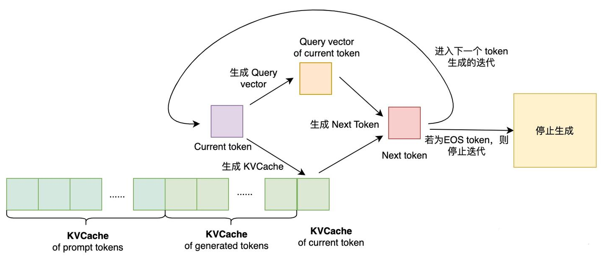
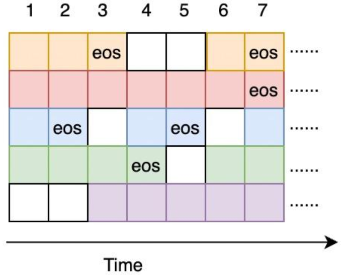

# LLM Serving

## 1. LLM特点

### 1.1 自回归模型简介

LLM最核心的模块是**自回归的Transformer模型**。自回归模型可通过序列的联合条件概率公式表示：

$$
P(x)=P(x_1) \cdot P(x_2|x_1) \cdot ... \cdot P(x_n|x_1,...,x_{n-1})
$$

如公式所示，自回归模型生成文本时需要计算多个时刻的条件概率。在实际模型运行时，自回归模型生成文本需要经过多轮迭代生成完整文本。生成文本的流程可以抽象为生成token的循环，循环内部主要分为以下两个步骤：
1. **生成下一个token**。每次迭代需要根据模型的文本输入 (Prompt)以及已生成的tokens上文信息，计算出下一个token的生成概率，即$$(x_n|x_1,...,x_{n-1})$$，最后通过采样或者搜索策略找出本次迭代生成的token。
2. **判断是否结束生成循环**。当生成一个结束符标志 (EOF token)，表示模型已经完成该请求，此时跳出循环。另外，受制于GPU显存大小、模型长文本生成效果等因素，一般结束条件还包括最大生成长度 (`max_dec_length`)。

所以，基于自回归模型的LLM生成文本过程是一种基于迭代的串行操作，是一种内存受限 (memory-bound)操作 (计算访存比较低，模型权重访问频繁)，其性能瓶颈主要在访存上。这样使得GPU的计算能力没法得到充分利用，从而影响LLM服务的吞吐。

### 1.2 KV Cache的来源

自回归Transformer通过**SelfAttention**机制建模。SelfAttention流程主要可分为三个步骤：
1. 将输入的序列$$x$$映射到三个向量空间中，分别得到三个向量$$q,k,v$$。
2. 计算$$q,k$$向量注意力得分，得到注意力得分$$a_{ij}$$，表示第$$i$$个位置的token和第$$j$$个位置 ($$j \le i$$)的token的得分。个注意力得分组成一个向量$$a_i$$，表示第$$i$$个位置的token和其余位置$$i$$之前所有位置token的得分向量。
3. 注意力得分向量$$a_i$$与$$v$$做内积，得到SelfAttention的最终输出$$o_i$$。
$$
q_i=W_qx_i,k_i=W_kx_i,v_i=W_vx_i
$$

$$
a_{ij}=\frac{\text{exp}(q_i^Tk_j/\sqrt{d})}{\sum_{t=1}^{i}\text{exp}(q_i^Tk_t/\sqrt{d})},o_i=\sum_{j=1}^ia_{ij}v_k
$$

通过上述公式可知，对于自回归Transformer来说，在计算$$a_{ij}$$时，除了需要计算得到的$$q_i,k_i,v_i$$，还需要$$k_j,v_j(j<i)$$。由于之前迭代生成第j个token时已经计算过$$k_j,v_j(j<i)$$，并且后续迭代生成可以直接复用$$k_j,v_j$$，所以自回归的Transformer模型都使用缓存的方式将计算过的$$k,v$$向量缓存到显存中，避免每次迭代重复计算上文$$k,v$$向量。这就是KV Cache。

## 2. LLM服务

**吞吐**是LLM服务最重要的性能指标之一，提升LLM服务的吞吐可以降低服务部署成本。提升模型服务的吞吐最直观的方式是**将尽量多的请求合并成一个模型输入 (即batching)，使单次推理能完成尽量多的请求计算**。因为对一个合并请求单次推理可以共享模型权重，多个请求推理只需访问一次权重，计算访存比提升，访存开销能被batch请求所增加的计算开销覆盖，所以单次推理合并越多请求，吞吐越高。**对于模型服务来说，单次推理最大合并请求数主要受显存制约**。所以，提升模型服务吞吐这个研究话题可以转变成在显存一定的情况下，提升单次推理最大合并请求数。这也是LLM服务最关注的问题。

### 2.1 LLM服务WorkFlow

在LLM服务中，用户一个请求包含一个输入的prompt tokens$$(x_1,...,x_n)$$，即一段文本，服务生成$$T$$个tokens$$(x_{n+1},...,x_{n+T})$$，并将tokens合并成一段文本返回客户端。如上文自回归模型的介绍，LLM 服务需要逐token生成。由于KVCache主要用于加速生成token时的attention计算，而生成第一个token时并不存在KVCache，无法直接使用prompt的KVCache进行attention计算，所以LLM服务生成文本的流程主要分为两个阶段：**Prompt**阶段 (生成第一个token，在TGI里也称**Prefill**阶段)以及**Decode**阶段 (生成第二及后续token)。

#### 2.1.1 Prompt阶段

#### 2.1.2 Decode阶段

### 2.2 Batching策略

如上文提到，Batching能提升模型服务的吞吐。常规的模型服务的Batching策略如下：
1. 设置一个Batching延时以及最大Batch Size；
2. 收到新请求时，将请求入队，并判断请求队列中的请求数是否达到最大Batch Size或者最早请求与最迟请求的到达时间差是否达到Batching延时，如果条件满足，则执行第3步骤，否则继续休眠直至Batching超时或者新请求到达；
3. 对合并后的模型输入进行模型推理，得到完整的模型结果，将结果返回客户端，服务返回步骤2的状态，等待下一个Batch的请求。

对于生成式的LLM模型服务来说，使用常规的模型服务Batching策略会有两个问题：
1. **请求端到端延时提升**。论文里提到两个延时：Batching延时以及请求在队列里的等待延时。在高并发场景下，请求在队列的等待耗时约等于前序批次请求的推理耗时总和。由于大模型是自回归模型，推理耗时主要在Decode阶段。Decode阶段的耗时与生成的tokens数 (迭代次数)成正比。生成文本长度越长，Decode耗时越长。生成单个token耗时在毫秒级别，那么生成千级别token数Decode耗时基本在秒级别，所以等待延时可达秒级别。线上服务基本无法接受这么长的请求等待延时。
2. **GPU计算、存储资源有效利用率低**。模型输入输出的长度不一致。文本长度不一致对模型输入和输出端的影响不同：
    - 对于模型输入而言，由于文本输入长度不同，在构造模型输入的时候需要进行padding预处理，那么在进行模型推理的时候就会引入对padding位的计算，浪费了GPU计算资源 (不过现在已经有一些变长推理优化策略解决这个问题[2])。
    - 推理引擎需要将batch内所有请求完成文本生成后，才会对下一个batch的请求进行推理。由于不同请求生成长度可能不同，在整个batch到达某一轮迭代时，部分请求可能已经完成推理，但此时推理引擎仍然会继续完成剩余请求推理，直至所有请求完成推理。每当一轮迭代完成一个请求的推理，意味着下一轮请求多了一个空转的请求推理，而请求队列里的请求又无法直接使用当前batch内已完成推理的请求使用的GPU计算资源，导致GPU资源浪费。

之所以造成上述两个问题，是因为常规的模型服务采用**Request-Level**方式调度请求，如上图所示。当Batch全部请求完成推理后，再将请求队列中的请求插入到Batch输入，然后进行下一个Batch的推理。每个请求推理阶段由若干个Decode迭代组成，整个推理阶段耗时太长，并且每个请求推理耗时又不一致，导致上述两个问题的出现。

目前，[3]针对LLM服务请求调度优化提出**Iteration-Level**请求调度方式，与Request-Level方式相比，请求调度在时间维度上粒度减小了。具体做法是，当完成一轮Decode迭代时，如果Batch内有请求完成推理，则将该请求剔除出Batch；如果有新的请求进入，则将新请求加入到当前Batch进行推理。通过这种调度优化方式，可以同时解决上述两大问题：
1. **延时方面**：可以大幅度降低请求端到端延时。由于队列的请求在Decode阶段动态地插入到Batch，所以请求的队列等待时间从原来的秒级别下降到毫秒级别 (仅需等待一轮迭代即可插入到Batch中)。
2. **资源利用率方面**：提升GPU资源有效利用率。由于队列的请求在Decode阶段每一轮结束后动态地插入到Batch，而Batch也在迭代过程中动态地删除已完成推理的请求，这样避免了GPU空转，提升资源利用率。

所以，vLLM 将基于Iteration-Level请求调度策略之上优化模型服务。

### 2.3 LLM显存占用分析

LLM服务显存占用主要由三部分组成：**模型权重**、**KVCache**以及**其他激活值**。

对于KV Cache，现有的LLM服务会先预分配一块显存池，然后对显存池进行读写实现对KV Cache的访问。但是，为每个请求预分配一段KV Cache会造成内部碎片、外部碎片等显存浪费。vLLM正是在KV Cache的显存管理上实现了按需分配的策略，从而提升服务的最大batch size。

### 2.4 总结

现有LLM服务存在请求的端到端耗时高、GPU资源有效利用率低以及KV Cache显存开销大这三大问题，针对这三个问题，提升吞吐有以下几种方法：
1. **Batching策略优化**：使用Iteration-level的请求调度策略替代Request-level的请求调度策略；
2. **低精度量化**：量化模型权重，提升KV Cache的显存占用上限；量化激活值，包括KV Cache，提升KV Cache最大batch size；
3. **KV Cache显存管理策略优化**：使用按需分配显存策略代替预分配显存策略。

vLLM主要通过1、3两种方式来优化LLM服务吞吐，方式2与方式1、3不冲突，在vLLM之上可以综合量化方式继续优化吞吐。

## 3. Dynamic Batch (Continous Batch)

