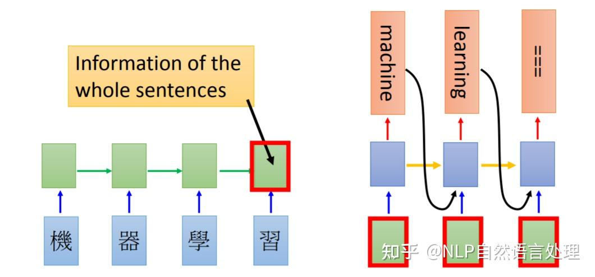
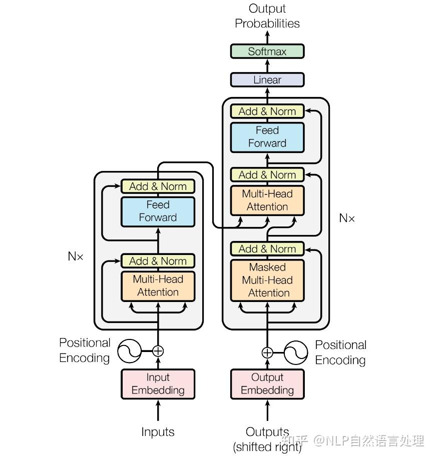
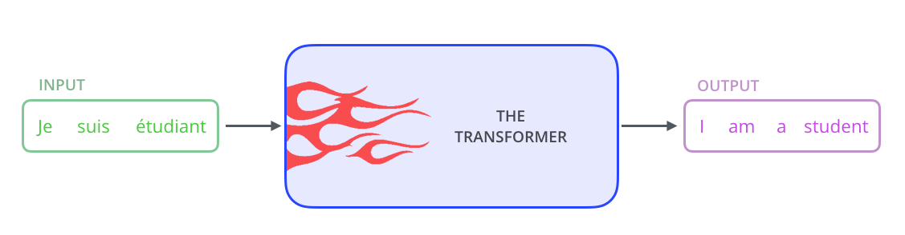
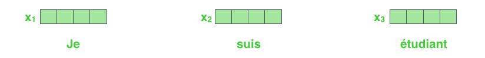
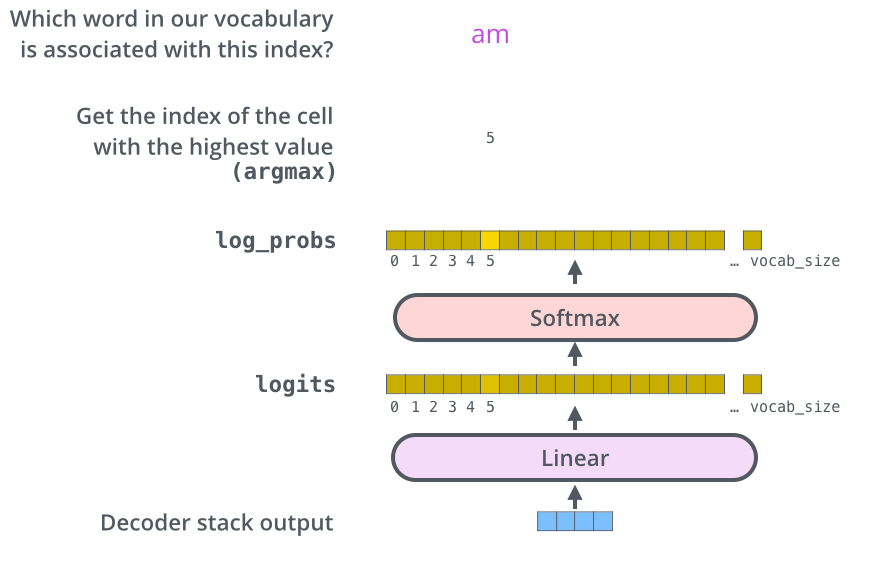

# neurips17 - Transformer

> Attention is All You Need

## 1. 引言

Transformer模型的其中一个优点，就是使得模型训练过程能够并行计算。在RNN中，每一个time step的计算都依赖于上一个time step的输出，这就使得所有的time step必须串行化，无法并行计算；而在Transformer中，所有time step的数据，都是经过Self Attention计算，使得整个运算过程可以并行化计算。如下图所示：

Transformer使用了Seq2Seq任务中常用的结构 -- 包括两个部分：Encoder和Decoder，如下图所示：

## 2. 从整体宏观来理解Transformer

首先，我们将整个模型视为黑盒。在机器翻译任务中，接收一种语言的句子作为输入，然后将其翻译成其他语言输出。

中间部分的Transformer可以拆分为两个部分：左边是编码部分 (encoding component)，右边是解码部分 (decoding component)。

其中编码部分是多层的编码器 (Encoder)组成 (Transformer的论文中使用了6层编码器，这里的层数6并不是固定的，也可以根据实验效果来修改层数)。同理，解码部分也是由多层的解码器 (Decoder)组成 (论文里也使用了6层的解码器)。

每一个编码器在结构上都是一样的，但它们的权重参数是不同的。每一个编码器里面，可以分为2层：
1. Self-Attention Layer
2. Feed Forward Neural Network (前馈神经网络，缩写为FFNN)

输入编码器的文本数据，首先会经过一个Self Attention层，这个层在处理一个词的时候，不仅会使用这个词本身的信息，也会使用句子中其他词的信息。接下来，Self Attention层的输出会经过前馈神经网络。同理，解码器也有这两层，但是这两层中间还插入了一个Encoder-Decoder Attention层，这个层能帮助解码器聚焦于输入句子的相关部分。

## 3. 从细节来理解Transformer

### 3.1 Transformer的输入

和通常的NLP任务一样，我们首先会使用词嵌入算法 (embedding algorithm)，将每个词转换为一个词向量。实际中向量一般是256或者512维。为了简化起见，这里将每个词的转换为一个4维的词向量。

那么整个输入的句子是一个向量列表，其中有3个词向量。在实际中，每个句子的长度不一样，我们会取一个适当的值，作为向量列表的长度。如果一个句子达不到这个长度，那么就填充全为0的词向量；如果句子超出这个长度，则做截断。句子长度是一个超参数，通常是训练集中的句子的最大长度。

编码器 (Encoder)接收的输入都是一个向量列表，输出也是大小同样的向量列表，然后接着输入下一个编码器。

第一个编码器的输入是词向量，而后面的编码器的输入是上一个编码器的输出。

这里我们可以注意到Transformer的一个重要特性：每个位置的词向量经过编码器都有自己单独的路径。具体来说，在Self Attention层中，这些路径之间是有依赖关系的；而在Feed Forward (前馈神经网络)层中，这些路径之间是没有依赖关系的。因此这些词向量在经过Feed Forward层中可以并行计算。

### 3.2 Encoder (编码器)

上面我们提到，一个编码器接收的输入是一个向量列表，它会把向量列表输入到Self Attention层，然后经过feed-forward neural network (前馈神经网络)层，最后得到输出，传入下一个编码器。

每个位置的词都经过Self Attention层，得到的每个输出向量都单独经过前馈神经网络层，每个向量经过的前馈神经网络都是一样的。

## 4. Self-Attention整体理解

举一个例子，假设我们想要翻译的句子是：The animal didn't cross the street because it was too tired.

这个句子中的it是一个指代词，那么it指的是什么呢？它是指animal还是street？这个问题对人来说，是很简单的，但是对算法来说并不是那么容易。当模型在处理 (翻译)it的时候，Self Attention机制能够让模型把it和animal关联起来。

同理，当模型处理句子中的每个词时，Self Attention机制使得模型不仅能够关注这个位置的词，而且能够关注句子中其他位置的词，作为辅助线索，进而可以更好地编码当前位置的词。

相反：RNN在处理一个词时，会考虑前面传过来的hidden state，而hidden state就包含了前面的词的信息。而Transformer使用Self Attention机制，会把其他单词的理解融入处理当前的单词。如下图：

## 5. Self-Attention的细节

### 5.1 计算Query向量、Key向量、Value向量

下面我们先看下如何使用向量来计算Self Attention，然后再看下如何使用矩阵来实现Self Attention (矩阵运算的方式，使得Self Attention的计算能够并行化，这也是Self Attention最终的实现方式)。

计算Self Attention的第1步是：对输入编码器的每个词向量，都创建3个向量，分别是：Query向量，Key向量，Value向量。这3个向量是词向量分别和3个矩阵相乘得到的，而这个矩阵是我们要学习的参数。

注意，这3个新得到的向量一般比原来的词向量的长度更小。

### 5.2 计算Attention Score (注意力分数)

第2步，是计算Attention Score (注意力分数)。假设我们现在计算第一个词Thinking的Attention Score (注意力分数)，需要根据Thinking这个词，对句子中的其他每个词都计算一个分数。这些分数决定了我们在编码Thinking这个词时，需要对句子中其他位置的每个词放置多少的注意力。

这些分数，是通过计算Thinking对应的Query向量和其他位置的每个词的Key向量的点积而得到的。如果我们计算句子中第一个位置单词的Attention Score (注意力分数)，那么第一个分数就是q1和k1的内积，第二个分数就是q1和k2的点积。

第3步就是把每个分数除以某个数，这是为了在反向传播时，求取梯度更加稳定。

第4步，接着把这些分数经过一个Softmax层，Softmax可以将分数归一化，这样使得分数都是正数并且加起来等于1。

这些分数决定了在编码当前位置的词时，对所有位置的词分别有多少的注意力。很明显，在上图的例子中，当前位置的词会有最高的分数，但有时，关注到其他位置上相关的词也很有用。

第5步，得到每个位置的分数后，将每个分数分别与每个Value向量相乘。这种做法背后的直觉理解就是：对于分数高的位置，相乘后的值就越大，我们把更多的注意力放到了它们身上；对于分数低的位置，相乘后的值就越小，这些位置的词可能是相关性不大的，这样我们就忽略了这些位置的词。

第6步是把上一步得到的向量相加，就得到了Self Attention层在这个位置的输出。

上面这张图，包含了Self Attention的全过程，最终得到的当前位置的向量会输入到前馈神经网络。但这样每次只能计算一个位置的输出向量，在实际的代码实现中，Self Attention 的计算过程是使用矩阵来实现的，这样可以加速计算，一次就得到所有位置的输出向量。

## 6. 使用矩阵计算Self-Attention

第一步是计算Query，Key，Value的矩阵。首先，我们把所有词向量放到一个矩阵X中，然后分别和3个权重矩阵相乘，得到Q，K，V矩阵。

接着，由于我们使用了矩阵来计算，我们可以把上面的第2步到第6步压缩为一步，直接得到Self Attention的输出。

## 7. 多头注意力机制

Transformer的论文通过增加多头注意力机制 (一组注意力称为一个attention head)，进一步完善了Self Attention层。这种机制从如下两个方面增强了attention层的能力：
1. 它扩展了模型关注不同位置的能力。在上面的例子中，第一个位置的输出z1包含了句子中其他每个位置的很小一部分信息，但z1可能主要是由第一个位置的信息决定的。当我们翻译句子：The animal didn't cross the street because it was too tired时，我们想让机器知道其中的it指代的是什么。这时，多头注意力机制会有帮助。
2. 多头注意力机制赋予attention层多个"子表示空间"。下面我们会看到，多头注意力机制会有多组的权重矩阵 (在Transformer的论文中，使用了8组注意力 (attention heads))。每一组注意力的的权重矩阵都是随机初始化的。经过训练之后，每一组注意力可以看作是把输入的向量映射到一个"子表示空间"。

接着，我们把每组K、Q、V计算得到每组的Z矩阵，就得到8个Z矩阵。

接下来就有点麻烦了，因为前馈神经网络层接收的是1个矩阵 (其中每行的向量表示一个词)，而不是8个矩阵。所以我们需要一种方法，把8个矩阵整合为一个矩阵。

怎么才能做到呢？我们把矩阵拼接起来，然后和另一个权重矩阵相乘。

## 8. 使用位置编码来表示序列的顺序

到目前为止，我们阐述的模型中缺失了一个东西，那就是表示序列中单词顺序的方法。

为了解决这个问题，Transformer模型对每个输入的向量都添加了一个向量。这些向量遵循模型学习到的特定模式，有助于确定每个单词的位置，或者句子中不同单词之间的距离。这种做法背后的直觉是：将这些表示位置的向量添加到词向量中，得到了新的向量，这些新向量映射到Q/K/V，然后计算点积得到attention时，可以提供有意义的信息。

## 9. 残差连接

编码器结构中有一个需要注意的细节是：编码器的每个子层 (Self Attention层和FFNN)都有一个残差连接和层标准化 (layer-normalization)。

在解码器的子层里面也有层标准化 (layer-normalization)。

## 10. Decoder (解码器)

编码器一般有多层，第一个编码器的输入是一个序列，最后一个编码器输出是一组注意力向量K和V。这些注意力向量将会输入到每个解码器的Encoder-Decoder Attention层，这有助于解码器把注意力集中输入序列的合适位置。

在完成了编码 (encoding)阶段之后，我们开始解码 (decoding)阶段。解码 (decoding)阶段的每一个时间步都输出一个翻译后的单词。

接下来会重复这个过程，直到输出一个结束符，Transformer就完成了所有的输出。每一步的输出都会在下一个时间步输入到下面的第一个解码器。Decoder就像Encoder那样，从下往上一层一层地输出结果。正对如编码器的输入所做的处理，我们把解码器的输入向量，也加上位置编码向量，来指示每个词的位置。

解码器中的Self Attention层，和编码器中的Self Attention层不太一样：在解码器里，Self Attention层只允许关注到输出序列中早于当前位置之前的单词。具体做法是：在Self Attention分数经过Softmax层之前，屏蔽当前位置之后的那些位置。

Decoder Attention层的原理和多头注意力 (MultiHeaded Self Attention)机制类似，不同之处是：Decoder Attention层是使用前一层的输出来构造Query矩阵，而Key矩阵和Value矩阵来自于编码器 (Encoder)最终的输出。

## 11. 最后的线性层和Softmax层

Decoder最终的输出是一个向量，其中每个元素是浮点数。我们怎么把这个向量转换为单词呢？这是由Softmax层后面的线性层来完成的。

线性层就是一个普通的全连接神经网络，可以把解码器输出的向量，映射到一个更长的向量，这个向量称为logits向量。现在假设我们的模型有10000个英语单词 (模型的输出词汇表)，这些单词是从训练集中学到的。因此logits向量有 10000 个数字，每个数表示一个单词的分数。我们就是这样去理解线性层的输出。

然后，Softmax层会把这些分数转换为概率 (把所有的分数转换为正数，并且加起来等于1)。然后选择最高概率的那个数字对应的词，就是这个时间步的输出单词。

