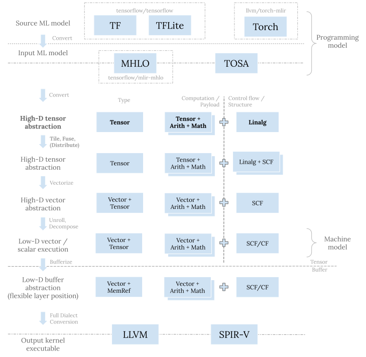

# MLIR Linalg Dialect

## 仿射变换（Affine Transformations）

### Linear vs. Affine

线性函数（Linear Function）的定义：
- 在数学中，线性函数是零次或一次的多项式函数（$$f(x)=ax+b$$）
- 在线性代数中，线性函数是一种线性映射（Linear Mapping）或线性变换（Linear Transformation）

### Linear Transformations

A Transformations (or mapping) $$f$$ is **linear** when for any two vector $$\vec{v}$$ and $$\vec{w}$$ (assuming the vectors are in the same vector space, say $$R^2$$):
- $$f(\vec{v}+\vec{w})=f(\vec{v})+f(\vec{w})$$
- $$f(k\vec{v})=kf(\vec{v})$$

In fact, it can be shown that for the kind of vector spaces we're mostly interested in, any linear mapping can be represented by a matrix that is multiplied by the input vector. This is because we can represent any vector in terms of the standard basis vectors: $$\vec{v}=v_1\vec{e}_1+...+v_n\vec{e}_n$$. Then, since $$f$$ is linear:
$$
f(\vec{v})=f(\sum_{i=1}^nv_i\vec{e}_i)=\sum_{i=1}^nv_if(\vec{e}_i)
$$

If we think of $$f(\vec{e}_i)$$ as column vectors, this is precisely the multiplication of a matrix by $$\vec{v}$$:
$$
f(\vec{v})=\begin{pmatrix} \mid & \mid & & \mid \\ f(\vec{e}_1) & f(\vec{e}_2) & \cdots & f(\vec{e}_n) \\ \mid & \mid & & \mid \end{pmatrix}\begin{pmatrix} v_1 \\ v_2 \\ \cdots \\ v_n \end{pmatrix}
$$

This multiplication by a matrix can also be seen as a change of basis for $$\vec{v}$$ from the standard base to a base defined by $$f$$.

### Affine Transformations

对于仿射空间，每个仿射变换的形式都是$$g(\vec{v})=A\vec{v}+b$$，其中$$A$$是表示线性变换的矩阵，$$b$$表示的是向量。换句话说，仿射变换结合了线性变换和平移。

With some clever augmentation, we can represent affine transformations as a multiplication by a single matrix, if we add another dimension to the vectors:
$$
f(\vec{v}) = T\vec{v} = \begin{pmatrix} 2 & 0 & 0.5 \\ 0 & 2 & 0.5 \\ 0 & 0 & 1 \end{pmatrix} \begin{pmatrix} v_1 \\ v_2 \\ 1 \end{pmatrix}
$$

### Affine Subspaces

> A subset $$U \subset V $$ of a vector space $$V$$ is an affine space if there exists a $$u \in U$$ such that $$U-u=\{ x-u|x \in U \}$$ is a vector subspace of $$V$$

### Affine Expressions and Array Accesses

> An expressions is affine w.r.t. variables $$v_1,v_2,...,v_n$$ if it can expressed as $$c_0+c_1v_1+...+c_nv_n$$ where $$c_0,c_1,...,c_n$$ are constants.

Affine expressions are interesting because they are often used to index arrays in loops

```c
for (int i = 0; i < M; i++) {
    for (int j = 1; j < N; j++) {
        arr[i][j - 1] = arr[i][j]
    }
}
```

Since C's memory layout for multi-dimensional arrays is row-major, the statement in the loop assigns a value to `arr[i * N + j - 1]` at every iteration. `i * N + j - 1` is an affine expression w.r.t. variables `i` and `j`

## MLIR Linalg Dialect

### 问题空间

### 设计考虑

#### 定位



上图中每一层都有其存在意图：
- 在最顶层，TF、TFLite、以及 Torch 等 dialect 用于机器学习框架的接入； MHLO 和 TOSA dialect 则将来自各种框架的五花八门的算子集（op set）收缩整合， 转化成统一的表示，作为下层 MLIR 代码生成栈的输入程序
- Vector dialect 这一层的目的是将小规模子问题进一步分解并映射到硬件寄存器和原生向量指令
- Memref dialect 这一层主要是用来做内存规划和读写。这一层的位置比较灵活， 既可以在转换成向量抽象之前，也可以在其之后
- 最底层有 llvm 以及 spirv dialect，转换到这一层是为调用 LLVM 编译器栈做进一步的更底层的代码生成，或者产生最终的程序 SPIR-V 二进制表示。

Linalg dialect 实际上是 MLIR 结构化代码生成的入口抽象。在其之前的 dialect 的目的是表达原机器学习程序，从 Linalg dialect 开始，我们不断进行变换来逐步贴合目标硬件。 这些变换包括分块、融合、分配、以及向量化。 它们统一的目标是对原问题进行划分并分配到不同的计算单元，之后把小规模的子问题交由 Vector dialect 来执行下一步代码生成。