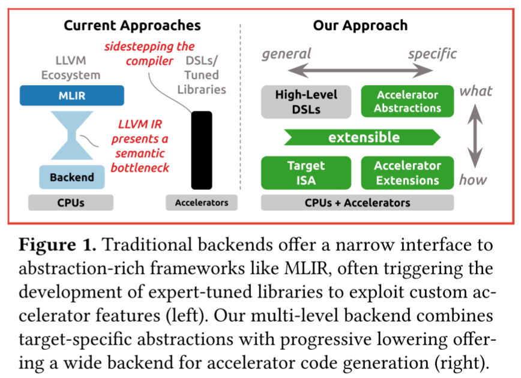

# CGO25 - 基于 MLIR 面向 RISC-V 指令集扩展的加速 Micro-Kernels 的多层编译器后端

> A Multi-level Compiler Backend for Accelerated Micro-kernels Targeting RISC-V ISA Extensions

尽管众多编译器（如 MLIR、TVM、OpenXLA）为 DNN 提供了高层优化，但性能关键的微内核仍需依赖专用代码生成器或手写汇编

尽管广泛采用的编译器（如 LLVM、GCC）提供了调优的后端，但其以 CPU 为中心的输入抽象、非结构化中间表示（IR）和通用的"最佳努力"设计，阻碍了为创新硬件生成定制化代码

论文认为，是时候拓宽传统的"沙漏型"后端，并在各种结构化抽象中采用渐进式 lowering 方法，将领域特定的代码生成引入编译器后端

我们通过为基于 RISC-V 的加速器（具有硬件循环和流寄存器）实现自定义后端，在与自定义指令集架构（ISA）匹配的抽象级别上利用硬件知识

我们在结构化 IR 上使用增量寄存器分配，同时摒弃传统的溢出启发式方法，并在关键 DNN 内核上实现高达 $$90\%$$ 的浮点单元（FPU）利用率。通过打破后端的"沙漏模型"，我们重新开辟了从领域特定抽象到专用硬件的路径

## 引言

> 现代通用编译器框架使用与目标无关的中层类 RISC 中间表示（IR）作为通用且经过良好优化的后端输入。因此，针对 LLVM IR 的 C/C++、Fortran、Swift、Rust 等众多语言都能受益于共享的中层优化和成熟的 CPU 后端

尽管基于 MLIR 的现代领域特定语言（DSL）编译器通过跨领域特定抽象渐进式 lowering，有效优化了机器学习（ML）中的深度神经网络（DNN）及其他领域，但它们通常以 LLVM 作为后端。LLVM 确实能较好地针对 CPU，**但其以加载-存储/算术/分支为中心的 IR**（虽对单指令多数据（SIMD）操作有良好支持），无法有效建模现代硬件的领域特定结构。英特尔在针对其 CPU 的优化 SIMD 时使用手写代码生成器，相比 LLVM 后端提供了更多控制

如图 1（左）所示，传统后端为 MLIR 等富含抽象的框架提供了狭窄的接口，这通常促使开发专家调优库以利用自定义加速器特性。我们的多层后端（图 1 右）将特定于目标的抽象与渐进式 lowering 相结合，为加速器代码生成提供了广泛的后端支持

> 我们通过提出多层后端来拓宽这一"沙漏"，该后端接受、保留并利用领域特定信息以针对创新硬件

我们的可扩展设计（图 1 右）不是使用单一的通用表示，而是公开了一系列静态单赋值（SSA）IR

> 我们将建模核心指令集架构（ISA）的基础 IR（如 RISC-V）与针对领域特定加速器扩展的结构化 IR 相结合。我们通过跨 IR 抽象操作的多层寄存器分配器支持结构化控制流和非标准寄存器使用，并证明在"最佳努力"寄存器分配中常见的溢出对于峰值性能并非必需
> 通过从高层 DSL lowering，我们表明，宽后端允许将领域特定概念直接 lowering 到相应的硬件特性，与传统后端相比简化了代码生成

我们将这一想法实现为 Snitch 的后端，Snitch 是一种可扩展的有序 RISC-V 内核，具有用于流寄存器和硬件循环的自定义扩展，并为 Snitch 生成高性能 DNN 内核。

我们的贡献包括：
- 以一组基于 SSA 的 IR 对 RISC-V ISA 和 Snitch 加速器扩展进行底层表示
- 用于结构化后端 IR 的多层无溢出寄存器分配器
- 从高层 DSL 渐进式 lowering 到上述基于 RISC-V SSA 的 IR
- 评估表明，手写微内核实现了峰值性能（高达 $$95\%$$ 的浮点单元（FPU）利用率），而通过微内核编译器针对高层线性代数 DSL 生成的代码性能接近（高达 $$90\%$$ 的 FPU 利用率）

## 背景

