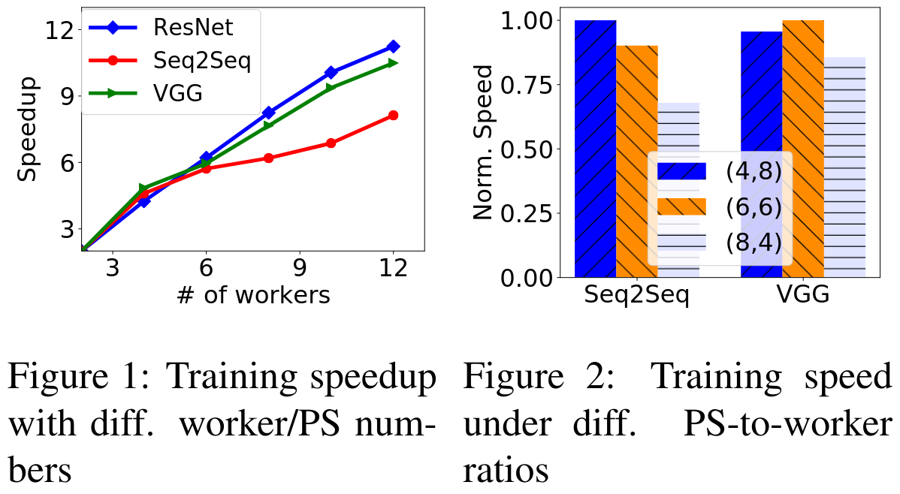
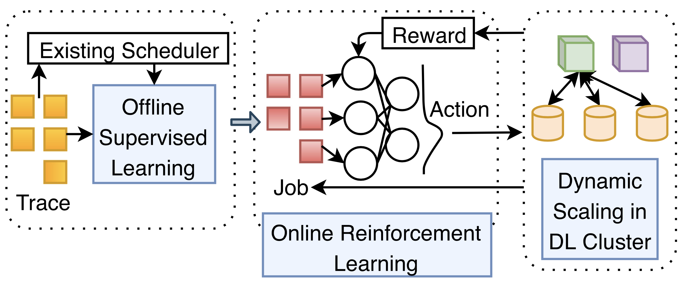

# TPDS21 - DL2

> DL2: A Deep Learning-driven Scheduler for Deep Learning Clusters

在这篇论文中, 作者提出了一个黑盒调度器**DL2**. DL2**基于策略迭代深度强化学习算法 (policy-based DRL)**而设计, 它将**集群当前的资源利用状态**作为输入, 将**资源分配方案**作为动作输出，并以**当前任务们的训练进度**作为反馈指导自身作出更加合理的决策. DL2在被投入线上进行增量强化学习之前, 会先在线下基于"**历史任务数据 (job traces)和对应的调度决策**"进行有监督学习, 这样可以保证DL2至少不逊于一个正在投入使用的scheduler

## 1. 研究动机

首先, DL训练任务的提交者需要列出当前任务需要多少个PS、多少个worker, 以及每个PS (和worker)需要多少数量的资源 (GPU、CPU、MEM). 提交之后, scheduler将会根据调度策略适时地将其从队列中取出, 并按照其需求说明为其分配资源. 然而, 对于一个DL任务, 提交者应当为其指定多少个PS和worker? 一般来说, PS (和worker)越多越好, 但是这会占用更多的资源. 作者发现, DL任务的训练效率并不随着PS (和worker)的数量呈线性增长 -- 而是一种**次线性**的关系, 即存在**边际效应递减**的现象. 如图1. 

此外, 对于一个DL任务, 如何设计合适的PS-worker比例是很困难的. 对于不同的DL任务而言, 使得其训练速度最大的PS-worker比例各不相同. 如图2. 

上述分析表明, 对于一个DL任务而言, 如何决定其最优的PS和worker的个数从而在**训练速度和边际效应之间作出折衷**是很困难的. 我们应当充分利用集群当前GPU的实际占用情况动态地为DL任务调度资源分配. DL2会根据集群的资源利用状态不断调整DL任务的PS和worker的个数, 从而使得集群利用率最大化. 

## 2. DL2: 设计与架构

DL2的目标是最小化DL任务的平均完成时间. 

DL集群包含多个节点, 每个节点配备有一个或多个GPU. 每当用户提交一个DL任务的时候, 他需要指明该任务每个PS (和worker)所需要的资源需求, 以及本次训练需要进行多少轮 (epoch). DL2周期性地执行资源分配的决策, 它允许资源的动态分配和调整 -- 即单个DL任务在不同的时间片可能有不同数量的PS (和worker)在运行. 对于同步训练 (所有worker都完成本地参数更新之后, PS才会开始averaging), 为了保证单个DL任务的总batch size不变, 当worker的个数发生变更时, 输入给每个worker的mini-batch大小会被调整; 对于异步训练, 输入给每个worker的mini-batch大小则保持不变。

DL2 采用的是基于策略梯度的方法, 其架构上图所示. 它包含三个组成部分: 
- **线下监督学习 (Offline Supervised Learning)**: 首先, 作者使用该集群历史运行数据 (job traces, 包含每个DL任务的抵达时间、资源清单以及集群默认调度器的调度决策)在线下预训练DL2的策略神经网络 (policy network). 这个有监督学习的过程采用随机梯度下降算法, 并采用交叉熵函数作为损失函数. 它保证DL2至少具备和默认调度器接近的性能. 如果不做这一步, 直接将policy network的参数随机初始化后就进行在线训练, 会导致policy network的性能非常不稳定;
- **在线强化学习 (Online Reinforcement Learning)**: 作者将调度周期的大小设定为1小时;
- **动态伸缩 (Dynamic Scaling)**: 作者修改了DL框架MXNet的部分源码, 从而使得DL任务可以被动态地添加或删除PS (或worker), 且其动态伸缩的开销是很小的

https://hliangzhao.cn/post/2022/08/22/tpds21-dl2/#3-dl2%E8%AE%BE%E8%AE%A1%E4%B8%8E%E6%9E%B6%E6%9E%84