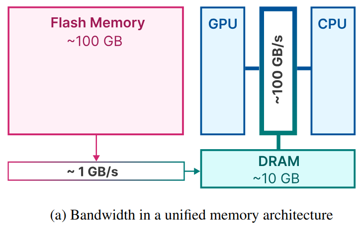
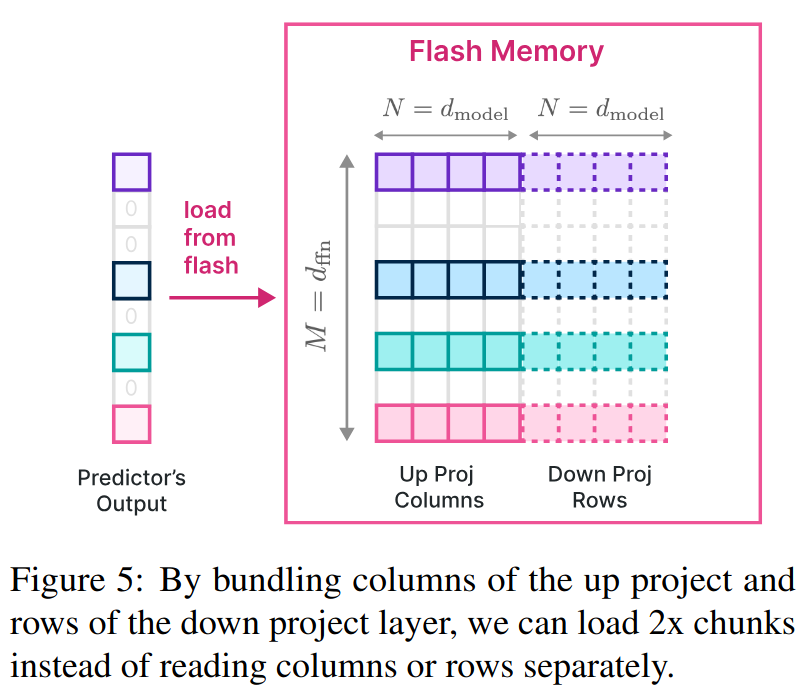
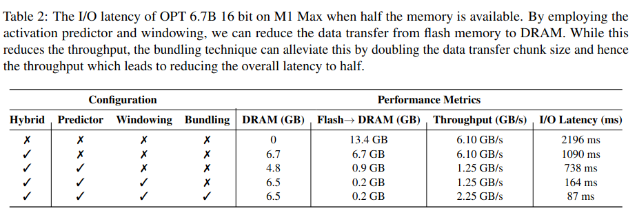

# ACL24 - LLM in a flash

> LLM in a flash: Efficient Large Language Model Inference with Limited Memory

## 1. Flash Memory and DRAM

在移动端设备中 (如手机)，DRAM可理解为"运行时内存"，Flash Memory可理解为"存储空间"。做一个简单的类比，在PC中，DRAM对应于内存；Flash Memory对应于硬盘存储 (注意：仅仅是对应于，实现方案并不一样)。

在通常的LLM推理阶段，LLM都是直接加载到DRAM中的。一个7B半精度LLM，完全加载进DRAM所需的存储空间超过14GB。考虑到目前主流手机的DRAM最高也就16GB的水平，在端侧直接使用DRAM来加载7B LLM面临巨大挑战。

下图给出了一个移动端标准的存储结构示意图。

Flash Memory的特点是大存储、低带宽；而DRAM的特点是小存储，高带宽。

现在的问题是：模型大小 > DRAM，所以无法将模型全部加载进DRAM。

苹果的解决方案是将LLM放在Flash Memory中，在每次需要进行推理时，仅仅将部分必要参数加载到DRAM中。

苹果的整个方案重点解决两个问题：
1. 如何快速识别出哪些模型参数是必要的；
2. 考虑到由Flash memory到DRAM的带宽较低，如何加快由Flash memory到DRAM的传输效率。

论文中从三个不同方面做了尝试。

## 2. 减少数据传输量

### 2.1 方法1：Selective Persistence Strategy

对于常见的LLM而言，它的模型参数主要由Attention参数和MLP参数两部分构成，其中Attention参数占比约为1/3，MLP参数占比约为2/3。除此，还有参数量级可忽略不计的Embedding层的参数。

因为Attention参数量相对较少，所以苹果的方案是将Attention参数和Embedding层的参数直接加载到DRAM中。

这就是所谓的Selective Persistence Strategy，其意为：有选择性地把部分参数常驻在DRAM中。而这部分常驻的参数就是Attention参数和Embedding参数。原因是因为它们占比较小。

### 2.2 方法2：Anticipating ReLU Sparsity

这里主要借鉴了DejaVu的思路：MLP层的输出只有不到10%的值是激活状态，一般把这种现象称为**稀疏性**。稀疏性越强，则非激活状态的值就越多。

要注意，此处的稀疏性一般称为"**Contextual Sparsity**"。即MLP层的哪些神经元会激活，与当前的输入相关。

苹果照搬了DejaVu的方法，使用一个两层MLP来预测哪些神经元会激活。方法也很简单，假设神经元个数为4096，只需要将MLP的输出层的大小设为4096，并为每一个输出使用sigmoid来做一个二分类即可 ("选择"or"不选择")。

注意：
- 不同Transformer层使用的预测模型不同；
- 同一个Transformer层中的MLP一般有两层，它们的激活神经元始终保持相同。

在能够准确预测的前提下，每次在推理时动态加载预测为激活神经元对应的参数即可。

### 2.3 方法3：Sliding Window

根据2.2小节中介绍的稀疏性可知，在每一次LLM进行前向推理时，它都需要使用模型预测每一个MLP层中激活神经元的编号，并将所需的神经元所对应的权重由Flash memory加载到DRAM中。

因为LLM的推理阶段是逐token进行的，这意味着在生成不同token的时候，需要加载到DRAM中的MLP的参数也不同。

用一个简单的例子来说明这个基础概念，只考虑第$l$层的Transformer模块。在处理当前token $$x_1$$时，该层使用模型$P^l$预测MLP会激活的神经元编号，假设为$$\lbrace 0, 1, 3, 5 \rbrace$$，并将其对应的参数$$W_l^1$$从Flash memory加载到DRAM中，然后进行推理。

在处理下一个token $$x_2$$时，将$$W_l^1$$从DRAM中删除，再使用模型$$P^l$$预测MLP会激活的神经元编号，假设为$$\lbrace 0, 2, 3, 6 \rbrace$$，并将其对应的参数$$W_l^2$$从Flash memory加载到DRAM中，然后进行推理。

注意到在我们的例子中，两次前向推理时，第$$l$$层的Transformer结构中MLP有部分被预测为激活的神经元是重叠的：$$\lbrace 0, 3 \rbrace$$。所以实际上在进行第二次前向推理时，没有必要把$$W_l^1$$完全从DRAM中删除，而是将其中编号为$$\lbrace 1, 5 \rbrace$$神经元对应的参数删除，再将编号为$$\lbrace 2, 6 \rbrace$$的神经元对应的参数读入即可。这样可以减少I/O的总开销。

这就是Sliding Window的核心思想：保留处理过去$$k$$个token时的激活神经元所对应的参数在DRAM中，并在处理当前token时只对：
1. 部分多余的参数进行删除；
2. 缺少的参数进行加载。

Sliding Window的核心假设是**LLM在处理相邻token时产生的稀疏性具有相似性**。

## 3. 提高传输吞吐量

### 3.1 Bundling Columns and Rows

通常LLM中的MLP层包含两个全连层。在忽略激活函数的情况下，这两个全连层可以写为：

$$y=xW_1W_2^T$$，其中输入$$x \in R^{1 \times d},W_1,W_2 \in dR^{d \times 1d}$$，$$d$$是维度。

在2.2小节中提到，稀疏性预测是对MLP中两个全连层同时进行的。也就是说，如果我们预测结果是第一个全连层中0号神经元不会被激活，那么该预测结果同样也适用于第二个全连层：第二个全连层的0号神经元也不会被激活。

对于第一个全连层的参数矩阵$$W_1$$，第$$i$$个神经元对应于它的第$$i$$列；对于第二个全连层的参数矩阵$$W_2^T$$，第$$i$$个神经元对应于它的第$$i$$行。

当第$$i$$个神经元被预测为激活时，需要同时读取$$W_1$$的第$$i$$列和$$W_2^T$$的第$$i$$行。所以为了提高读取速度，可以将$$W_1$$的每一列列和$$W_2^T$$的对应行拼接起来存储，如下图所示：

### 3.2 Bundling Based on Co-activation

**这是一个原文尝试过，但被验证为无效的策略**。

原文中猜测某些神经元之间可能存在一些紧密联系。比如对于两个神经元a和b，当a激活时，b也会激活 (或者当b激活时，a也会激活)。

因此可以通过分析来找到每个神经元的"closest friend" (与该神经元同时激活频率最高的其它某个神经元)。然后在存储Flash memory中存储时，也将它们的参数拼接存在一起。这样的读取效率更高。

但该方法之所以无效，主要原因是可能会存在某个神经元i，它是其它很多神经元的"closest friend"。这样导致的问题则是神经元i被额外传输了太多次，导致实际的I/O成本增加了。

## 4. Optimized Data Management in DRAM

虽然DRAM的数据读取速度比Flash memory快很多，但当需要对其中数据进行大量、高频读写时，它的时耗仍然不可忽略。在本文介绍的内容中，对DRAM的读写主要发生在对MLP层中所需神经元对应参数的删除与新增。

为此，论文中设计了一种特殊的数据结构来对DRAM中的数据做精细化管理。该数据结构的核心变量如下：
- Matrix：按照"Bundling Columns and Rows"的方法存储激活神经元所对应的参数；
- bias：激活神经元所对应的bias参数；
- num_used：激活神经元的个数；
- last_k_active：过去k个token所对应的激活神经元编号；
- Pointer：当前行参数对应的神经元编号。

以上图中最左图为例。图中矩阵的每一行是特定神经元 (Pointer对应的编号)的两个全连层参数的拼接向量。对于网络中的每一个Transformer层中的MLP，会预先分配一个大小为$$R_i \times 2d$$的矩阵。$$R_i$$表示预分配的行数，它表示预估的激活神经元最大值，靠实验得到。$$d$$是全连层的维度；$$2d$$是因为拼接了两个全连层的参数。

通过预分配一个足够大的空间，可以避免因反复分配而导致的额外开销。

该矩阵中的行对应的是当前存储在DRAM中激活神经元的参数。前文提到，当处理新的token时，需要将不会被激活的神经元删除，并添加新的会被激活的神经元。所以最重要的两个操作是"删除"和"新增"。
- 当需要删除某个神经元时，只需将num_rows的数量减1，并将最后一行Copy至被删除行，结果如图4的中图所示。虚线框表示当前有效的数据；
- 当需要"新增"时，直接将其对应的参数由Flash memory中copy至该矩阵中即可，无需额外分配存储空间。

## 5. 实验结果

苹果这篇paper的主要关注点在于：**让LLM在运行时内存受限的情况下能高效地跑起来**。所以论文的实验主要对比了各种情况下I/O导致的时耗，如下图所示。

