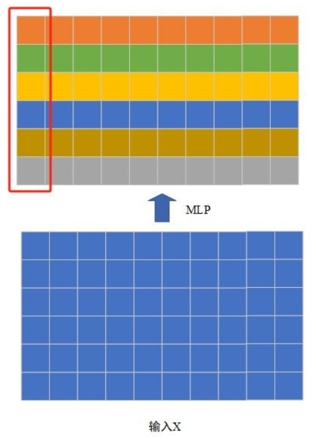

# ICML23 - DejaVu

> Deja Vu: Contextual Sparsity for Efficient LLMs at Inference Time

ICML23中比较有意思的一篇文章。它的核心方法是**在推理阶段，利用当前输入动态地选择部分网络参数来进行推理，而不是使用全参**。所以可以将其看作是一种"**动态剪枝**"的方法。苹果最近推出的**LLM in flash**算是对该方法的直接应用，可见DejaVu未来在移动端部署LLM的潜力会非常巨大。更重要的是，方案很简单。

提高LLM的推理速度在算力极为有限的情况下具有非常重要的现实意义。剪枝作为一种重要的模型轻量化手段，它的核心假设是**模型参数的稀疏性**：可以剪掉某些不重要的参数来减少模型参数量，并尽可能维持模型的表现。

在实际使用中，通常使用特定的剪枝算法从一个较大的LLM出发 (假设为模型A)，通过剪枝得到一个较小的LLM (假设为模型B)。在推理阶段，使用模型B完成计算，这个简单过程如下图所示。

在推理阶段，**对于任何输入X来说，LLM B的产生过程与它无关**。所以可以把这种剪枝方法称为"**静态剪枝**"，而静态剪枝基于的稀疏性假设称为"**静态稀疏性**"。

在DejaVu中，**LLM B与输入X相关**。所以可以把这种剪枝方法称为"**动态剪枝**"，而它基于的稀疏性假设称为"**动态稀疏性**"。在原论文中，使用的词是**Contextual Sparsity**。Contextual强调的是LLM B的产生与输入X有关，如下图所示。

上图中，LLM B的产生过程受输入X的影响。DejaVu要解决的核心是：**如何基于输入X从预训练好的LLM A中快速产生LLM B**。

## 1. Contextual Sparsity

Contextual Sparsity的本质是强调对于一个预训练好的LLM A，它的weight的重要性依赖于输入X。例如对于两个不同的输入X1和X2，经动态剪枝得到的LLM B是不一样的。这就是Contextual的含义，它指LLM B依赖于上下文，而上下文就是模型的输入。

但是Contextual Sparsity本身在LLM中存在吗？

原文验证Contextual Sparsity的方法很简单。首先，使用输入X进行一次前向推理，并记录输出具有较大norm的MHA (Multi-Head Attention)中的head和MLP中的神经元。

具体实现起来也比较容易。例如对于MHA，它的每一个head的输出是一个矩阵，我们只需要对这个输出矩阵计算它的L2 Norm，然后从所有head中挑选出L2 Norm最大的那几个head即可，如下图所示。

上图示例中，输入X的序列长度N=10，维度d=6。假设MHA的head数量为3，那么MHA的输出对应于三个不同的head，图中由不同颜色表示。只需计算每个head对应输出 (不同颜色区域)的L2 Norm，然后找出较大的head即可。

对于MLP，有一点小区别。对某个特定的token，MLP的输出是一个向量。但此时不能计算整个向量的L2 Norm，而是要看哪一个输出维度的L2 Norm较大。这是因为整个向量是依靠所有神经元计算得到的，而每一个维度对应于一个神经元，如下图所示。

MLP是逐position执行的，所以它的物理意义应该按照图中红色框的形式来理解：每一列是输入中每一列 (token)的变换。但是在寻找有效神经元时，需要按照行来挑选。换言之，需要计算每一行的L2 Norm，然后挑出具有较大Norm的神经元。

在找到具有较大Norm的head和神经元后，原论文中使用相同的输入X再一次进行前向推理，但此时仅使用挑选出的部分head和MLP中的部分神经元参与计算。原文中发现，仅使用挑选出的部分head和神经元，几乎不影响模型的效果。

也就是说，通过这样一个简单的实验验证，作者们认为LLM中存在Contextual Sparsity：LLM中存在与输入强相关的部分高效参数。仅使用这些部分参数，能得到与使用全参模型几乎一致的表现。

再强调一次，不同输入X对应的高效参数部分是不一致的。这区别于传统剪枝方法，这也是为什么称为Contextual Sparsity的原因。

> 注：Transformer论文中MHA的每个head输出是通过拼接成一个与输入尺寸一致的tensor，然后再接全连层做变换。论文中因为需要挑选部分head，所以MHA的流程有一点点小变化：每个head的输出会先接一个全连层来变化为与输入尺寸一致的tensor；然后对所有head的输出求平均和。所以不论选多少个head，MHA的输出尺寸都是一致的。

前文提到，可以通过计算Attention head和MLP中神经元输出的L2 Norm来找到"高效参数"。但这个比例大概是多少？例如，假设我们已经将所有的head的L2 Norm和所有MLP中神经元的L2 Norm都计算出来了，那么究竟选top多少的head和神经元作为"高效参数"？

原文基于OPT模型的实验结论如下：
- Attention head的稀疏率约为80%；
- MLP中神经元的稀疏率约为95%。

即：在实际推理过程中，我们可以只使用约20%的Attention head和约5%的MLP神经元，就能达到和全参模型差不多的效果。

## 2. 稀疏性预测

想要利用前文提到的稀疏性来加快推理速度，需要有方法来提前准确地预测对于当前输入X，哪些head和哪些MLP中的神经元是"高效参数"。

这里需要两个模型来做预测。第一个模型用来预测MHA中哪些head是"高效的"；第二个模型用来预测MLP中哪些神经元是"高效的" (神经元实际上对应于参数矩阵的某一列或某一行。至于究竟是列还是行，依赖于对参数矩阵的定义形式)。

在DejaVu中，这两个模型的实现都使用了一个两层MLP。

以预测Attention的head编号为例，假设head数为256，只需要将MLP的输出层的大小设为256，并为每一个输出使用sigmoid来做一个二分类即可 ("选择"or"不选择")。

训练数据依靠一个完整的、训练好的LLM来产生。在这个LLM的推理过程中，通过记录它的Attention输入和Attention输出，并计算不同head的L2 Norm，再基于一个L2 Norm的阈值t将head分为正例和负例。

预测MLP中需要选择的神经元编号的思路与上述基本一致。

下面以一个Transformer模块为例，来说明一种朴素的实现方法。

假设当前的Transformer模块为网络的第$l$层，它对应的两个稀疏性预测模型记为$\text{SP}^{l}_{A}$和$\text{SP}^{l}_{M}$。$\text{SP}$是Sparsity Predictor的缩写；下标$A$表示Attention；下标$M$表示MLP；上标$l$表示当前的网络层数。

符号$\text{SP}^{l}_{A}$和$\text{SP}^{l}_{M}$意味着不同网络层使用的稀疏性预测模型是不同的。

假设当前的输入为$x$，首先使用模型$\text{SP}^{l}_{A}$预测需要选择的head编号：
1. $a=\text{SP}_{A}^{l}(x)$
    - $a$可以理解为是一个索引集合，表示选中的head编号。
2. $out_1=\text{MHA}_a(x)$
    - $\text{MHA}$的下标$a$表示MHA只使用了$a$中编号所对应的head。
3. $b=\text{SP}_{M}^{l}(out_1)$
    - $b$可以理解为是一个索引集合，表示选中的神经元编号。
4. $out_2=\text{MLP}_b(out_1)$

## 3. 高效实现

基于MLP的稀疏性预测必须要尽可能高效地实现，否则整个LLM的推理时间可能会因为引入了额外的MLP而变得更慢。

### 3.1 并行化稀疏预测

假设$x$为当前层$l$的输入。并行化的方案是直接使用$x$来预测$l+1$层的head编号和MLP神经元编号。这相当于是**提前预测**。这样做的好处是：对第$l$层来说，它可以在计算MHA和MLP的同时预测下一层的head编号和MLP神经元编号。

因此原本只能串行执行的四步操作，其中预测编号的两步可以和剩下的两步并行执行了。

但是为什么能这样做？原文给出的理由是：**LLM中token的embedding的变化是非常缓慢的**。因为缓慢，所以提前一步去预测似乎也比较合理。

上图中的左图是连续的两个网络层token embedding之间的余弦相似度。上图中的右图是间隔n层的token embedding之间的余弦相似度。两个图非常直观，LLM中token的embedding的变化确实非常缓慢。因此，使用前一层的输入去提前预测下一层的两个编号，也就比较合理。

### 3.2 Kernel Fusion

在PyTorch中实现文中的稀疏矩阵乘法需要先用预测的编号索引去从参数矩阵中取对应的参数，这会导致3次I/O：
1. 读参数矩阵W；
2. 取完对应索引后写参数矩阵W1；
3. 读W1进行矩阵乘法计算。

显然对于当下的场景，2、3是多于的两步。但在PyTorch提供的算子中，只能这样去执行。

所以很简单的策略是单独写一个kernel，将1、2、3步合并在一起，这样I/O只有1次。
