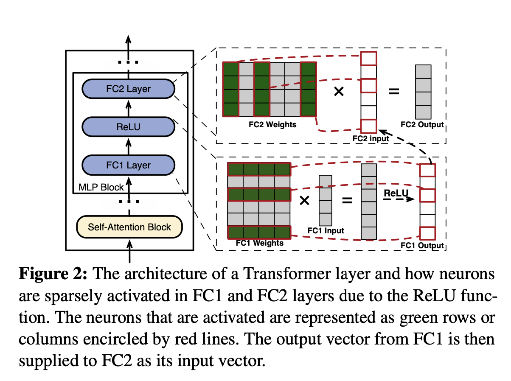
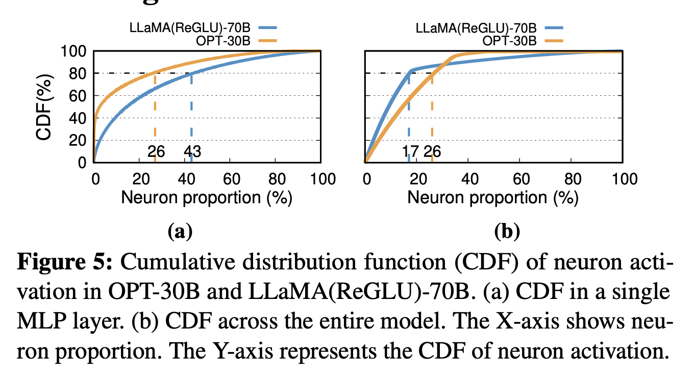
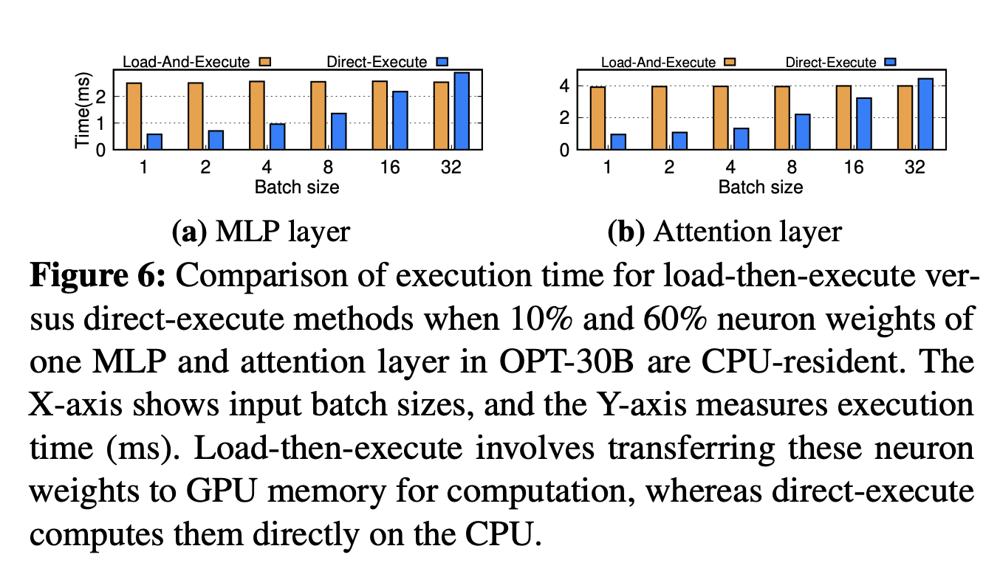
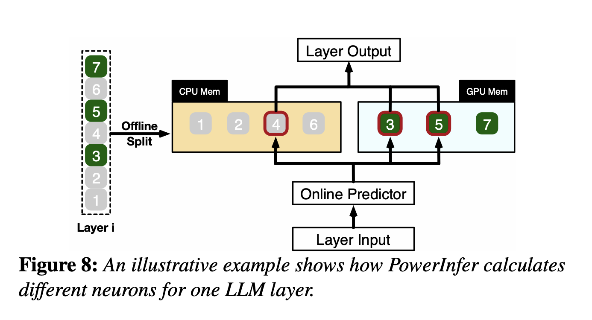
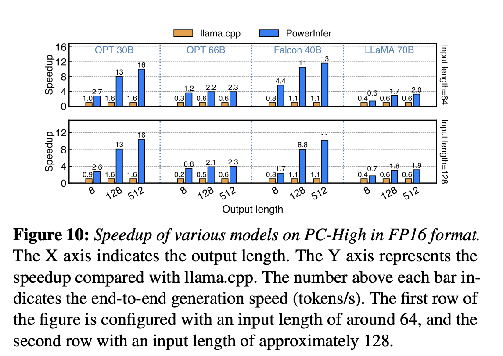
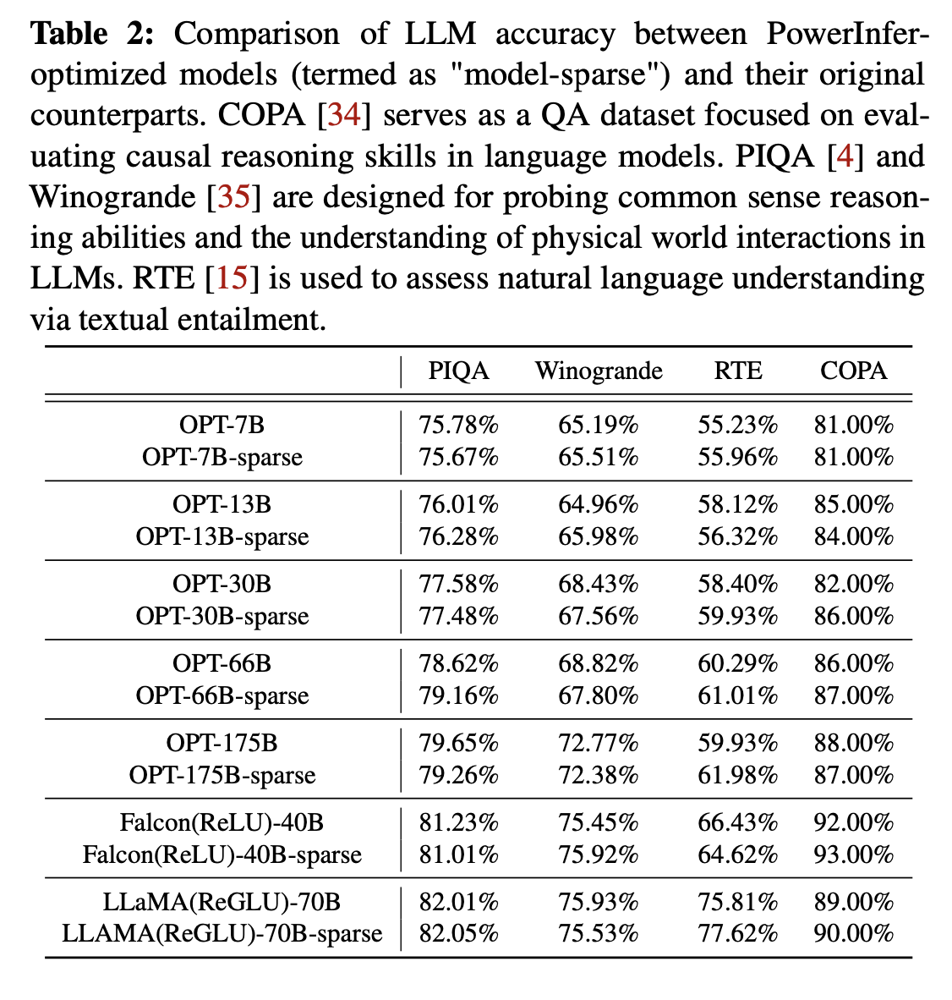

# SOSP24 - PowerInfer

> PowerInfer: Fast Large Language Model Serving with a Consumer-grade GPU

**摘要**：本文介绍了PowerInfer，这是一个在配备单个消费级GPU的PC上的高速大型语言模型（LLM）推理引擎。PowerInfer设计的关键在于利用LLM推理中固有的高局部性，其特点是神经元激活的幂律分布。这种分布表明，一小部分神经元（称为热神经元）在各种输入中持续被激活，而大多数神经元（称为冷神经元）则根据具体输入变化。PowerInfer利用这一洞察设计了一个GPU-CPU混合推理引擎：热激活神经元预先加载到GPU上以便快速访问，而冷神经元在CPU上计算，从而显著降低GPU内存需求和CPU-GPU数据传输。PowerInfer进一步整合了自适应预测器和神经元感知的稀疏运算符，优化了神经元激活和计算稀疏性的效率。评估表明：在单个NVIDIA RTX 4090 GPU上，PowerInfer实现了平均每秒生成13.20个token的速度，峰值达到29.08个token每秒，适用于各种LLM（包括OPT-175B），仅比顶级服务器级A100 GPU低18%。这显著优于llama.cpp多达11.69倍，同时保持了模型准确性。

## 1. Intro

在家用单机上部署大模型主要受制于memory（或者显存），之前的解决方法包括修剪模型、模型量化等，但是把OPT-66B的模型量化到4bit之后还是需要40G左右的显存，家用单机上不太可能有这么多资源，用CPU推理速度又太慢了。llama.cpp可以把不同的layer同时保存在内存和显存中，减少显存开销，但是推理速度因为PCIe太慢会大幅度下降。

Key Reason：
> "We have observed that LLM inference inherently exhibits high locality. Specifically, during each inference iteration, a limited number of neurons are activated, significantly influencing the outcome of token inference."
> "Notably, neuron activation in an LLM follows a skewed power-law distribution: a small subset of neurons consistently contributes to the majority of activations (over 80%) across various inputs (hot-activated), while the majority are involved in the remaining activations, which are determined based on the inputs at runtime (cold-activated)."

核心思想是把Hot Neuron放在显存里，Cold Neuron放在内存里，训练一个online predictor识别哪些neuron需要加载到显存里，这样走PCIe通信的内容只有必要的neuron。

问题：
1. Online Predictor带来的额外开销会不会很大？PowerInfer introduces an adaptive method for constructing smaller predictors for layers with higher activation sparsity and skewness. This iterative process reduces the size of the predictors while maintaining their accuracy, thus freeing up GPU memory for LLM inferences.
2. 只调用部分neuron（leveraging LLM sparsity）需要使用稀疏算子，传统的cuSPARSE基本没有优化（for general-purpose design）。PowerInfer designs neuron-aware sparse operators that directly interact with individual neurons, thereby bypassing operations on entire matrices. This approach enables efficient matrix-vector multiplication at the neuron level and removes the need for specific sparse format conversions.
3. 识别一个neuron是hot or cold、什么时候需要放到显存or移出显存很复杂。PowerInfer utilizes an offline phase to generate a neuron placement policy. This policy uses a metric that measures each neuron's impact on LLM inference outcomes and is framed as an integer linear programming problem.

## 2. Background and Motivation

### 2.1 LLM Inference & Architecture

> "In self-attention blocks, nearly half of the attention heads (neurons) make minimal contributions, leading to their high sparsity. The sparsity observed within the MLP blocks is primarily attributed to the characteristics of the activation functions."

介绍一下自回归生成是什么？给了左边这个架构图，注意到里面的激活函数是ReLU。

### 2.2 Offloading-Based LLM Serving

之前的工作主要可以分成**GPU-centric offloading**和**GPU-CPU hybrid Offloading**两种。

**GPU-Centric Offloading**：用内存存储超出显存容量的参数。GPU和CPU之间的数据传输很频繁，延迟很高。举例FlexGen和DejaVu。FlexGen采用一种"zig-zag scheduling approach to prioritize throughput over latency"；DejaVu只处理预测中要被激活的neuron，但是设计的时候是为了data center inference，在consumer-grade的GPU上运行的很差，总体表现出来的延时和FlexGen差不多。

**GPU-CPU hybrid Offloading**：llama.cpp。按照layer进行分割，CPU首先处理一部分，然后把中间结果送进GPU做计算，相当于传输reduce过的数据，提高了带宽的利用率；这种方法推理的时候还是要访问整个模型，并且把很大一部分计算的负载交给了性能并不高的CPU（因为内存更大），导致最后整体性能仍然受限。

## 3. Insights into Locality in LLM Inference

### 3.1 Insight-1: Power-law Activation

> While Insight-1 indicates that 43% of neurons account for 80% of the total activations in a single MLP layer, it is typically found that only about 10% of its neurons are activated during an individual inference iteration.

### 3.2 Insight-2: Fast In-CPU Compuation

走PCIe传输太慢了，慢到在batch size小的情况下在CPU本地利用AVX做计算的时间可能比传输到GPU然后再算的时间还短。

## 4. PowerInfer Overview

### 4.1 Architecture and Workflow

分为Offline和Online两个阶段：
- **Offline阶段**，利用LLM Profiler and Policy Solver统计LLM推理时Neuron的激活规律，把Neuron标记成Hot or cold，在硬件规格（可利用的显存资源）和Neuron带来的"影响度"之间均衡求解ILP；
- **Online阶段**，predictor预测每次inference需要激活哪些neuron，存在哪里就由谁来计算（Insight2），然后汇总并且输出结果。

## 5. Neuron-aware Inference Engine

Online Predictor + 调度器

### 5.1 Adaptive Sparsity Predictors

需要在预测准确性和模型大小之间取得平衡。同时predictor访问频率很高，所以需要保存在GPU显存中。如果采用固定大小的predictor就会占用很多空间，但是减小predictor大小又会导致预测准确度过低、模型推理性能下降。

predictor大小主要受到两方面的影响：LLM layer的activation稀疏性和内部neuron的倾向性。如果一个layer的输出很稀疏，意味着预测起来比较简单，就可以采用比较简单的predictor，反之则需要更大的；内部的neuron倾向性也是类似，如果某层大部分时候都只有几个特定的被激活，那用很简单的predictor效果也很好。

出于对以上两种因素的优化，PowerInfer设计了一个大小不固定的predictor迭代训练方法。首先根据offline阶段统计的某层的sparsity指定参数量的baseline，然后迭代地根据内部activation的偏向性调整参数量。在迭代调整过程中，根据观察到的偏斜性修改隐藏层的维度。对于展示出显著偏斜性的层，逐渐减少隐藏层大小，直到准确性降低到95%以下。相反，对于偏斜性最小的层，增加维度以提高准确性。通过这种方法，PowerInfer有效地将预测器参数限制在LLM参数总数的仅10%。

### 5.2 Neuron Placement and Management

在CPU和GPU中各创建一张Neuron Table，将Neuron和矩阵中的原始位置相关联。做法和一般的稀疏计算的做法差不多？表的大小不大，对于175B的模型表也只有9MB左右，基本可以忽略。

### 5.3 GPU-CPU Hybrid Execution

根据Insight-2，cold neuron在CPU上做完计算再传输给GPU合并结果显然更好，但这样的话相当于出现了同一次inference的数据一部分在CPU上、一部分在GPU上，之间是否有相互依赖等关系是需要处理的。

PowerInfer在推理之前构造一个DAG描述推理中的op的顺序，在推理的过程中通过DAG维护一个操作队列，保证每个计算执行的时候父节点一定已经被执行完了，尤其是CPU上的op父节点在GPU上的时候，意味着需要保证GPU计算完成并且传回了CPU上（CPU上计算的结果都会传输到GPU上，这个过程已经被包含了，所以着重考虑CPU需要从GPU取数据的情况）。

考虑到GPU上计算的频率更高，CPU有的时候会闲置。PowerInfer在CPU没有执行任何计算的时候，会跳过本次结果同步，直接执行下一个layer/block的操作。

## 6. Neuron Placement Policy

### 6.1 Offline Profiling

喂一些常见的数据集然后统计Neuron的激活次数

### 6.2 Neuron Impact Metric

如果Profiling的时候数据很多，那就可以认为激活频率高的对LLM的推理贡献更大。感觉所有的工作都假设了语言数据全部都是同分布的。

### 6.3 Modeling of Neuron Placement

## 7. Implement

在llama.cpp上做修改得到，KV Cache之类的功能都保留了。支持OPT系、LLaMA、Falcon等。predictor用DejaVU进行训练。

## 8. Evaluation

### 8.1 Experimental Setup

Hardware：
- **PC-High**: Equipped with an Intel i9-13900K processor (eight physical cores at 5.4GHz) and 192GB host memory (memory bandwidth of 67.2 GB/s). This configuration includes an NVIDIA RTX 4090 GPU (24G) with a memory bandwidth of 1TB/s and operates with a PCIe 4.0 interface (64GB/s bandwidth).
- **PC-Low**: Features an Intel i7-12700K processor (eight physical cores at 4.9GHz), coupled with 64GB of host memory (memory bandwidth 38.4 GB/s). It also includes an NVIDIA RTX 2080Ti GPU (11G) with a memory bandwidth of 616GB/s and utilizes PCIe 3.0 interface (32GB/s bandwidth).

Model: 
> "We use a range of OPT models with parameters from 6.7B to 175B, as well as Falcon(ReLU)-40B and LLaMA(ReGLU)-70B models. Notably, the 175B parameter model is comparable in size to the GPT-3 model. For our experiments, all models in our experiments use FP16 and INT4 quantized parameters, with intermediate activations in FP32, consistent with recent LLM research practices."

### 8.2 End-to-End Performance

### 8.3 Ablation Studies

### 8.4 LLM Accuracy

## 9. Conclusion

> "PowerInfer is a fast inference system optimized for LLMs that exploits the locality property in LLM inference. It utilizes adaptive predictors and neuron-aware operators for neuron activation and computational sparsity. PowerInfer achieves up to 11.69X faster LLM inference compared to systems like llama.cpp, without compromising accuracy."