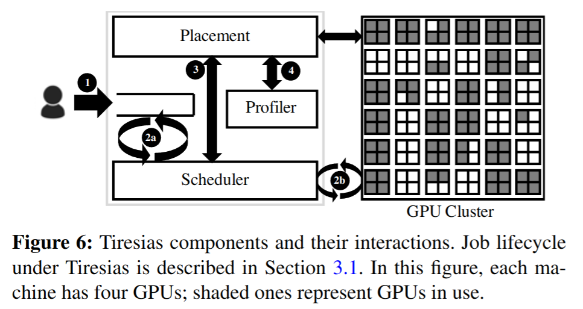
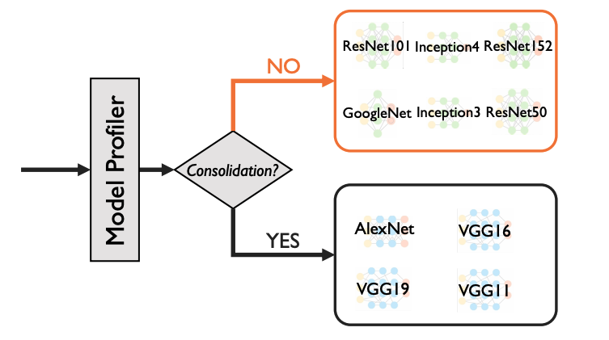

# NSDI19 - Tiresias

> Tiresias: A GPU Cluster Manager for Distributed Deep Learning

## 1. Background and Motivation

作者讨论了分布式深度学习 (DDL)调度程序在生产中面临的三个主要挑战: 

### 1.1 Unpredictable job duration

Some of the existing schedulers try to predict the DL job training times by assuming DL jobs have smooth loss curves. However, because of the trial-and-error characteristic of DL jobs, their loss curves are not as smooth as the curves of the best model ultimately picked at the end of exploration. Thus, the scheduler should not rely on the loss curve for predicting eventual job completion time. 

### 1.2 Over-aggressive job consolidation

Because DL jobs are sensitive to GPU locality, many existing solutions assign all components of the job to the same or the minimum number of servers. As a result, jobs often wait when they cannot be consolidated, even if there are enough spare resources elsewhere in the cluster. 

### 1.3 Time overhead of preemption

The common way to preempt Unlike preemption in CPU, GPU preemption usually takes tens of milliseconds. 

## 2. Design

The main objectives of Tiresias are:
1. minimizing the average **job completion time (JCT)**
2. achieving high GPU utilization
3. avoiding starvation

To address the aforementioned challenges, Tiresias uses an aged based scheduler called **Two-dimensional Attained Service-Based Scheduler (2DAS)**. 2DAS assigns each job a priority based on its attained service. The attained service of a job is calculated based on the number of GPUs it uses and the amount of time it has been running so far. 

When no job duration information is provided, the priority function applies the **Least-Attained-Service (LAS)** algorithm where a job's priority is inverse to its attained service. If the distribution of job duration is provided, then a job's priority equals its Gittins index value. 

Using continuous priorities can lead to a sequence of preemptions (preemption is both time-consuming and expensive in GPUs) and subsequent resumptions for all jobs. Tiresias address this challenge by using **the classic Multi-Level Feedback Queue algorithm (多级反馈队列算法)**. 

Another insight of Tiresias is that the skew of the model structure can be a good predictor of whether a job is sensitive to consolidation, because the message size distribution in DLL depends on the tensor size distribution of the model. Based on this insight, Tiresias profiler identifies the amount of skew in tensor distributions across parameter servers and if it is larger than a predefined threshold, Tiresias attempts to consolidate the job in as few machines as possible. 

## 3. 实验中的硬件配置与互联方式

- **InfiniBand网络**: 所有服务器通过100 Gbps EDR Mellanox InfiniBand网络互联
- **RDMA (Remote Direct Memory Access)**: 实验中使用RDMA技术进行GPU之间的通信
- **GPFS文件系统**: 集群中的所有服务器共享一个高性能GPFS文件系统, 用于存储和读取作业的检查点文件