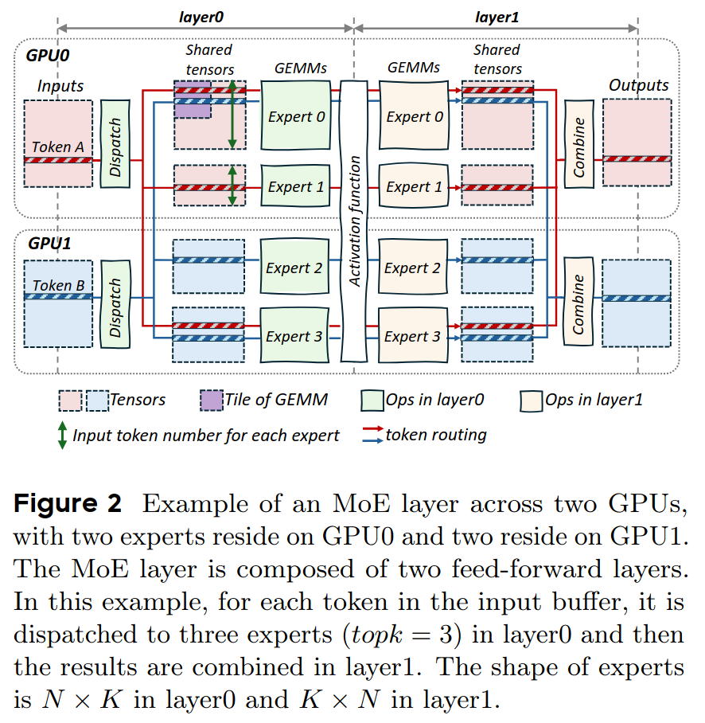
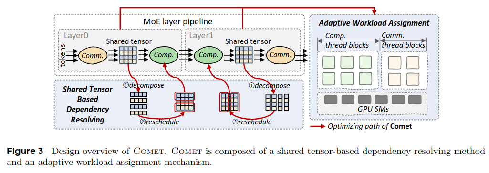
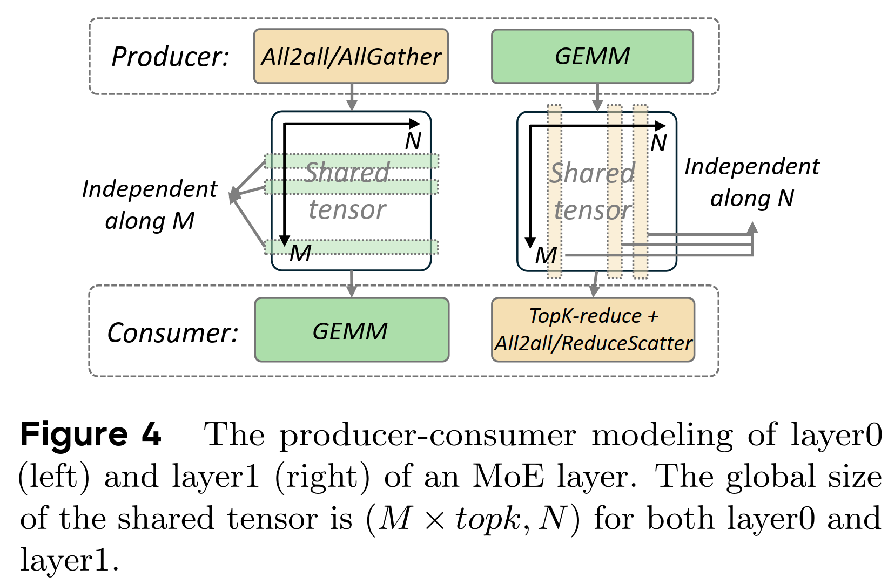
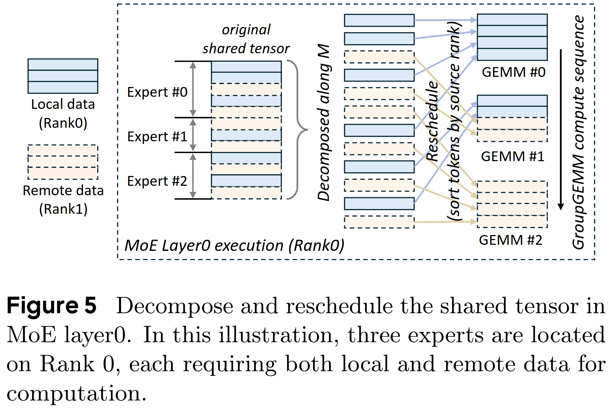
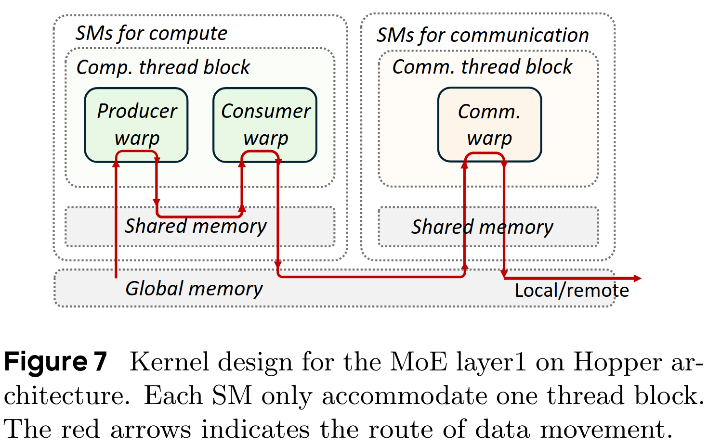
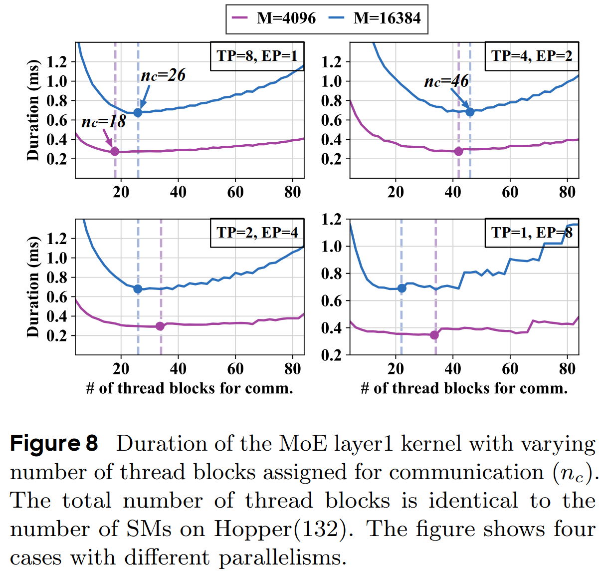

# MLSys25 - Comet

> Comet: Fine-grained Computation-communication Overlapping for Mixture-of-Experts

混合专家模型 (MoE)通过稀疏激活机制突破了传统稠密模型 (Dense Model)的计算瓶颈，然而MoE的分布式训练仍面临一项严峻挑战：**跨设备通信开销巨大**。例如，Mixtral-8x7B模型在Megatron-LM框架中的通信时间占比可高达40%，严重制约了训练效率和成本。

核心问题在于，MoE的专家网络分布在多个GPU上，每次计算需频繁执行Token分发与结果聚合，导致GPU计算资源大量闲置。因此，如何将通信隐藏到计算的过程中，提升模型训练效率、节省计算资源，成为了MoE系统优化的关键。

## 1. 难点1：「复杂的数据依赖」与「流水线气泡」

为了掩盖巨大的通信开销，现有方案主要集中在如何对「计算-通信」进行高效重叠。

一种方案是将流水线调度与通信算子结合起来，即通过定制训练中流水线并行的调度方式，将不同microbatch的计算和通信进行重叠，如DeepSeek的DualPipe。但是，这一方式会导致较大的显存开销，并需要对现有训练框架进行复杂的侵入性改动。

其它MoE系统方案则是在microbatch内部采用了粗粒度的计算-通信流水线，将输入数据分割成「数据块」进行通信与计算的重叠。然而，这种粗粒度的重叠方式难以高效利用计算资源，且无法实现无缝的通信延迟隐藏，尤其在动态路由、异构硬件环境下，性能损失显著。

### 1.1 难以解决复杂的数据依赖

MoE架构的稀疏特性导致计算和通信间的依赖动态且复杂。MoE会动态地将Token分配给不同专家，而传统的粗粒度矩阵分块方式，会导致GPU频繁等待远程数据，从而造成计算资源闲置。‍

如下图所示，当专家0需要在紫色「数据块」中进行Tile-level的计算时，必须先通过Token-level的通信接收远程数据 (Token B)，这种由于复杂数据依赖导致的计算-通信粒度上的错配，使得效率严重下滑。

### 1.2 难以消除计算-通信流水线气泡

另一个问题是，现有方法无法精确控制计算任务和通信任务对硬件资源的使用，因而，也无法根据不同的模型结构和动态输入，来自适应地调整资源分配。这导致计算和通信无法实现无缝重叠，进而产生大量流水线气泡，增加了系统的延迟。

### 1.3 总结

因此，团队认为：解决MoE模型中计算与通信的**粒度不匹配**问题是实现两者高效重叠的关键，同时，还需要根据负载情况自适应调整通信和计算的资源分配，以进一步实现无缝重叠。

## 2. COMET核心方案

COMET是一个针对MoE模型的通信优化系统，通过细粒度计算-通信重叠技术，助力大模型训练优化。

团队分析发现，MoE架构包含两条不同的生产-消费流水线：「计算-通信流水线」和「通信-计算流水线」。如下图所示，数据在流水线中流动时，各流水线内的操作会通过一个共享缓冲区链接，该缓冲区被称作「共享张量」。

基于此，COMET引入**两项关键机制**，以最小化整体延迟并提升流水线性能

### 2.1 共享张量依赖解析

通过分解和重调度共享张量，解决通信与计算之间的粒度错配问题，实现细至单Token级的重叠。

**张量分解**：将MoE层间传递的共享张量沿Token维度 (M)或隐层维度 (N)进行切割，使通信与计算的最小单元对齐。例如，在MoE第一层 (Layer 0)沿M维度分解，使通信和计算在M维度进行对齐；在MoE第二层 (Layer 1)沿N维度分解，细粒度传输Token结果，保证计算和通信的高效重叠。

**计算重调度**：为了更好地隐藏计算与通信的延迟，COMET会动态调整数据块的计算顺序。例如，优先计算本地数据块，同时异步拉取远程Token。当某个专家需处理Token A (本地)和Token B (远程)时，系统会优先启动Token A的计算线程，并与Token B的通信线程并行执行，从而消除等待延迟。

### 2.2 自适应负载分配

动态分配GPU线程块资源，精准平衡通信与计算负载，消除流水线气泡。

**线程块隔离**：将通信与计算任务分别封装在独立线程块中，避免远程I/O阻塞计算核心。在Nvidia Hopper架构中，计算线程块专用于执行异步TMA指令的GEMM运算，通信线程块通过NVSHMEM实现单Token级数据传输，这种设计赋予了系统在算子级别进行资源管理的能力。

**动态负载平衡**：根据输入规模 (如Token长度 M)、并行策略 (EP/TP比例)实时调整线程块分配。如下图所示，当TP=8、EP=1时，通信线程块占所有线程块的比例为19.7%，而当TP=4、EP=2，该比例需提升至34.8%，系统通过预编译多个版本的计算-通信融合算子实现在运行时的「零开销」算子动态切换，并始终提供低延迟的算子。

## 3. 核心代码

