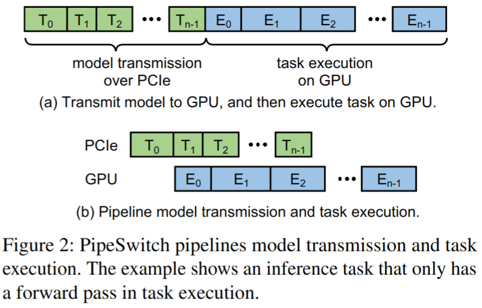
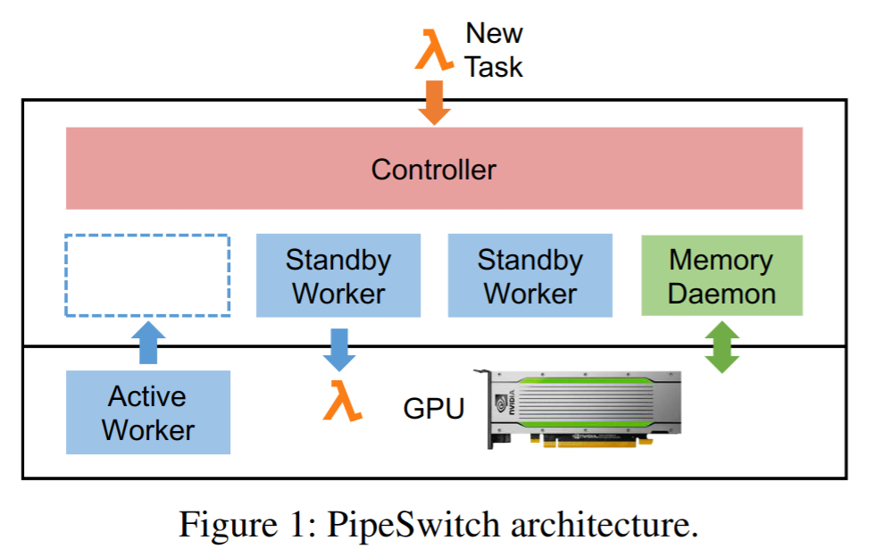

# OSDI20 - PipeSwitch

> PipeSwitch: Fast Pipelined Context Switching for Deep Learning Applications

PipeSwitch主要解决了这样一个问题: 如何在GPU上进行高效的多任务切换. 现有的多任务系统支持例如Nvidia MPS远谈不上高效 (切换时间甚至达几秒, 而很多推理任务的SLO可能是毫秒级). 但这样的系统对于调度是由重要作用的. 

考虑这样一个场景: 将训练和推理任务混合部署在同一个集群里. 训练任务一般是时间较长, SLO不敏感; 推理任务则是对SLO相当敏感, 且可能具备明显的潮汐特性 (例如一些在线推理到了晚上workload会比白天轻一些). 我们既想要将训练和推理混合部署, 同时又希望它们之间的切换能够高效, 这就是PipeSwitch希望解决的问题. 

PipeSwitch为DL定制了一套专门的**多任务GPU context switch**方案, 能够使得多任务在同一GPU上高效地进行分时复用, 并且这些任务的切换时间只在毫秒级别, 在满足推理任务的SLO前提下完成切换. 

之所以说是专为DL定制的, 是因为PipeSwitch利用了DL任务一个非常重要的特性 -- DNN模型通常都包含多个layer, 且计算都是按layer的顺序进行的, 最前面的layer会在前向传播时首先被用到. 于是基本思路就有了: 在做context switch的时候, 优先将靠前的layer所需要的状态信息加载进GPU中，同时GPU就先计算这些已经ready的layer, 整个过程被流水线化了 (图b). 而现有做法 (图a)则是将整个DNN作为一个大黑盒, 将它无脑地完整加载到GPU之后, 再按layer进行计算. 相比之下, 显然PipeSwitch这种思路高效得多. 这种流水线的思路其实在去年SOSP上出现的PipeDream和ByteScheduler中也都有体现. 

## 1. 系统概览

- **Controller**: 它从客户端接收任务, 并控制Memory Daemon和Worker来执行任务; 
- **Memory Daemon**: 管理GPU内存和DNN模型, 它将GPU内存分配给Active Worker, 并将模型从主机内存传输到GPU内存;
- **Active Worker**: Active Worker是当前在GPU中执行任务的worker. 这里的worker指的是在一个GPU上执行任务的进程;
- **Standby Worker**: 服务器上有一个或多个Standby Worker. Standby Worker处于空闲状态, 正在初始化新任务, 或者正在为上一个任务清理其环境. 

## 2. 系统设计

### 2.1 Pipelined Model Transmission