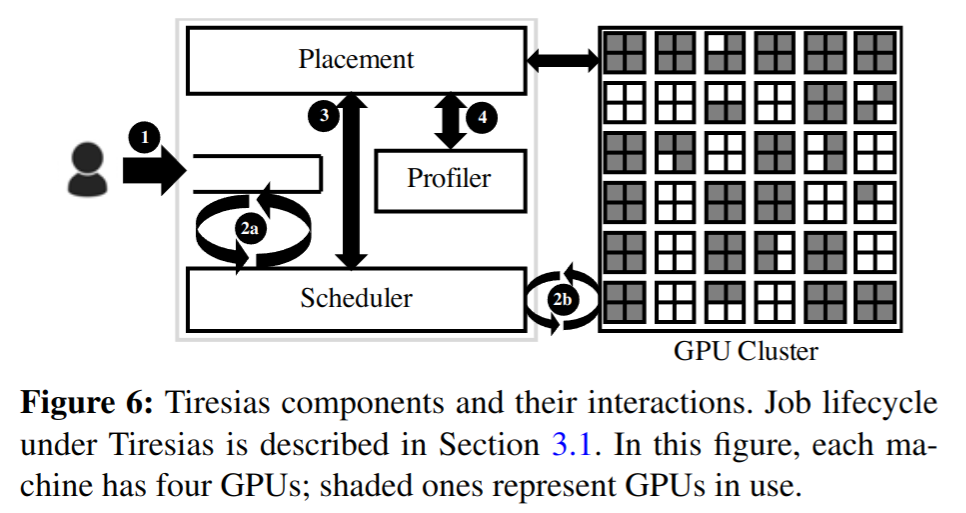

# NSDI19 - Tiresias

> Tiresias: A GPU Cluster Manager for Distributed Deep Learning

## 1. Background and Motivation

作者讨论了分布式深度学习 (DDL)调度程序在生产中面临的三个主要挑战: 

### 1.1 Unpredictable job duration

Some of the existing schedulers try to predict the DL job training times by assuming DL jobs have smooth loss curves. However, because of the trial-and-error characteristic of DL jobs, their loss curves are not as smooth as the curves of the best model ultimately picked at the end of exploration. Thus, the scheduler should not rely on the loss curve for predicting eventual job completion time. 

### 1.2 Over-aggressive job consolidation

Because DL jobs are sensitive to GPU locality, many existing solutions assign all components of the job to the same or the minimum number of servers. As a result, jobs often wait when they cannot be consolidated, even if there are enough spare resources elsewhere in the cluster. 

### 1.3 Time overhead of preemption

The common way to preempt Unlike preemption in CPU, GPU preemption usually takes tens of milliseconds. 

## 2. Tiresias

The main objectives of Tiresias are:
1. minimizing the average job completion time (JCT)
2. achieving high GPU utilization
3. avoiding starvation

