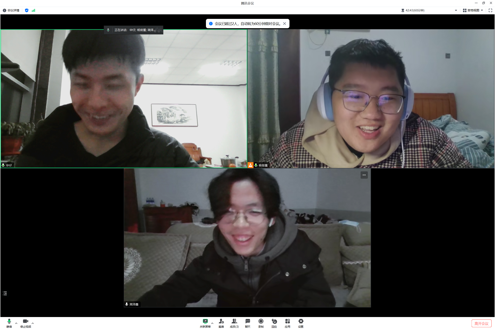
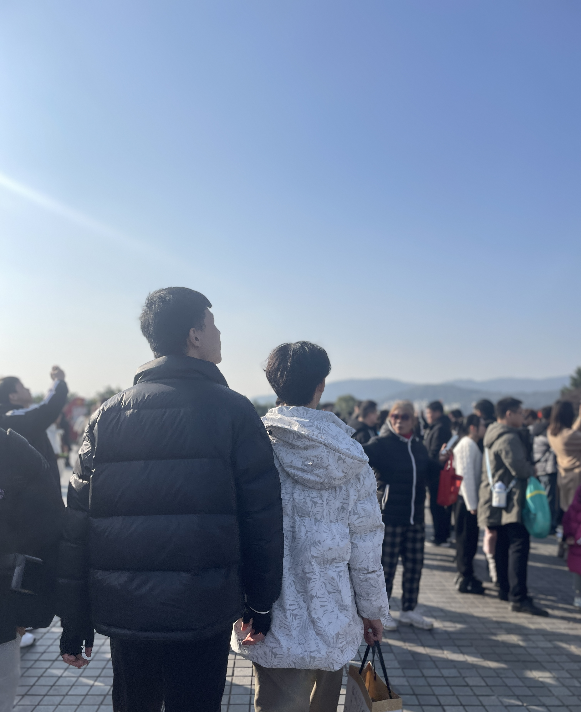
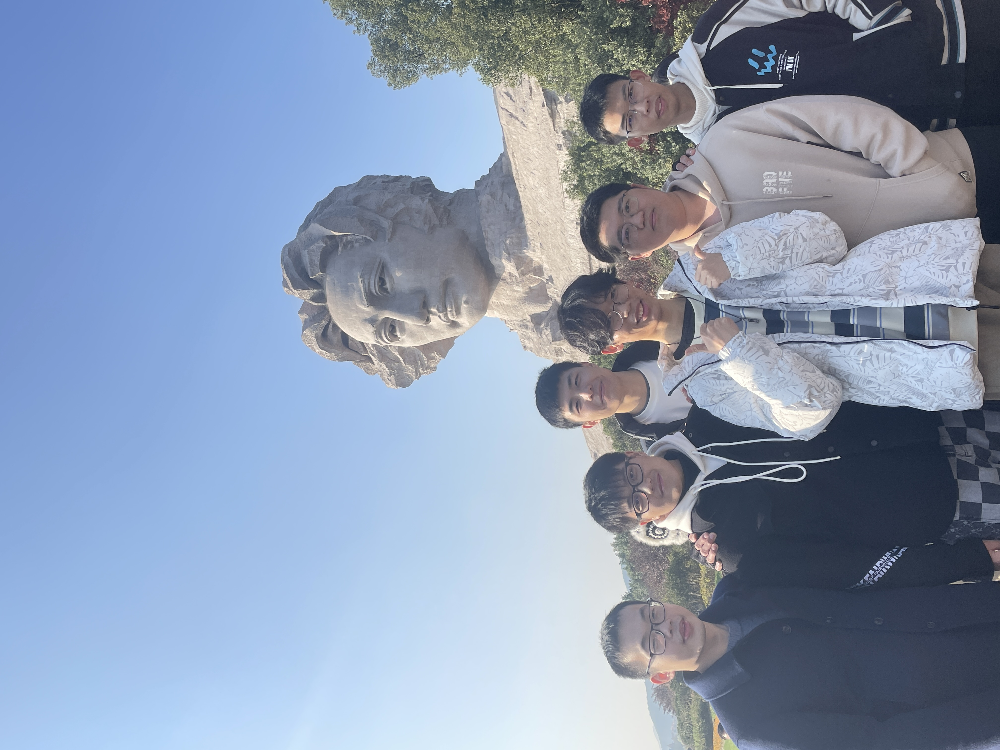

# 2024，路漫漫其修远兮

> 我将继续寻找，就算这无尽的星辰令我的寻找希望渺茫，就算我将单枪匹马。

曾子曰“吾日三省吾生，为人谋而不忠乎？与朋友交而不信乎？传不习乎？”2024年去到了很多地方，看到了外面世界的广阔，也遇到了很多优秀的人，这段时间内也发现了自己很多不足，希望自己可以一直坚持自己的理想。须知少时凌云志，曾许人间第一流。

## ⬅️ 回顾2024

> 天地生君子，君子理天地。

写年终总结之前，感慨万千，但真到要写的时候，却不知道如何下笔，那就随便聊聊吧。

### 学习

对于我而言2024年的关键词就是**保研**了，因为2024年下半年就开始保研推免了，所以今年大部分的时间都是在为了保研做准备 -- 疯狂刷绩点、打比赛、联系老师实习等等，不过最后还是去到了自己满意的课题组啦！在这过程中我很幸运，遇到了很多志同道合的朋友，和他们一起合作了大大小小的项目，一起熬夜，一起为比赛中性能的提升而欢呼雀跃，当然也取得了相对而言不错的成绩，但也留下了遗憾。但是我自己觉得，也正是因为有了遗憾，所以就一直激励着我们下次要更加努力、思考更加周到，从而获得自我进步。

#### 比赛

2024年年初的**数模美赛**，当时和华仔、瓜哥一直准备这个比赛，读美赛优秀论文，每天汇报一下自己关于如何应对这次美赛的心得想法。比赛的时候和他们一直开着腾讯会议交流，过程彼此鼓励，特别是最后一天，熬了一整晚（差点g了），虽说结果不是很令人满意（呜呜呜呜），但其实我也很感谢这次经历，我们彼此之间更加默契了。贴一张当时我们视频的图，哈哈哈哈哈哈。

4月份的**程序设计竞赛** -- 蓝桥杯和天梯赛，通过这几次比赛发现自己确实不适合算法这个赛道，要一直刷题刷题，可能是因为高中三年一直刷题，对刷题产生阴影了吧😭。但结果相对而言比较满意。（图好像找不到了😭）

6月份的**网络挑战赛**，和定中合作了一次，当时正好一顿事情堆在一个时间段，所以这个比赛当时准备的也不充分，不过也获得了不错的成绩。（这个也没拍照😭）

7月份的**集创赛**，自己对于硬件不是很了解，所以当时准备这个比赛的时候有很多需要学的硬件知识，不过很感谢爽子和焯哥，大佬带我，哈哈哈哈哈哈，取得了相对不错的成绩。（当时好像也忘记拍照了😭）

8月份的**编译竞赛**，这个比赛我们小组准备了挺长时间，从今年3月份一直到8月份，但是临到比赛截止提交时却接连出问题，最后结果也有点差强人意，不过通过这个比赛对系统也产生了浓厚的兴趣，小组成员之间也越来越默契，当然也希望我们明年可以弥补这个遗憾。（不过有一说一，杭州那边真是美食荒漠，好难吃😭）。贴个图。

今年最后一个比赛就是11月份的**红山操作系统**了，开始下定决心学习Rust这门语言，Rust第X次入门😂。这次和牛仔也算合作了一次，当然明年会继续和牛仔合作，希望在明年的全国操作系统比赛中拿到更好的名次。贴个图。

#### 论文

今年印象最深刻的还有一个就是发表论文，全程参与了论文的全过程，论文ddl之前一直和师哥、老师讨论实验结果的合理性、论文结构的润色等等，对于我而言是一次比较全新的体验，很开心可以和田老师合作，这次我学习到了很多知识。最后我们所做的工作也被Nips录取了，哈哈哈哈哈哈，开心。贴个图。

### 生活

> 读万卷书，行万里路。

2024年借着夏令营、比赛等诸多的机会，去到了很多地方，看到了很多没看到的风景，遇到了很多有趣的人，很幸运。

#### 聚散

首先是今年和家的见面明显多了起来，哈哈哈哈，一起去西安旅游，爬了华山，看了城墙、大雁塔、大唐不夜城、兵马俑等等等，吃了肉夹馍、油泼面、biangbiang面、岐山臊子面等等等；在北京一起玩耍，逛了清华、北大，看了颐和园；畅谈人生理想......之前和和家一直是打电话，畅谈人生理想，彼此鼓励，很高兴遇到了家，和他成为了人生知己，哈哈哈哈哈哈，我相信我们俩慢慢的都会实现自己的梦想，成为越来越好的人。

今年年初和朱同学一起去到了桂林那边旅游玩耍，当时其实也是临时起意（哈哈哈哈，来了一场说走就走的旅行），所以准备的就比较仓促，不过还是看到了很多壮阔的风景。

## 展望2025

> 路漫漫其修远兮，吾将上下求索。

我希望可以做一点事情，如此年轻的我，很想要去改变世界。同时也希望自己可以一直保持着自己的热爱。
